# Milestones at a glance — what was tried, what it measured, where it led

High-level map of every milestone (M0–M21) for orientation; each section links to the
full diary. **Campaign bar (M8→now):** any agent ≥ **0.55 vs `solver:lucario`** at n ≥ 800,
zero G1 crashes, sane latency — plus, since M10, the **meta_v2 co-gate** on promotion
(weighted win rate vs the frozen top-10 harvested-meta deck pool), and since M18 every gate
baseline is **2-seed pooled**. Current champion: `ppo_best_m20legB` + lucario (sub 54836093),
mirror **0.488** — 6.2pp short of the bar.

## Workflow

```mermaid
flowchart TD
    M0["M0 · Pipeline<br/>random-weights agent, encoders,<br/>parity gate, packaging<br/>✅ GO"]
    M1["M1 · Behavior cloning<br/>bc_v1.pt, 90% vs random<br/>✅ SHIPPED (54444045)"]
    M2["M2 · Beyond imitation<br/>PPO + inference MCTS both rejected<br/>fidelity law discovered<br/>⚖️ champion unchanged"]
    M3["M3 · Combat features<br/>fidelity 55%→56.4% only<br/>❌ NO-GO"]
    M4["M4 · Deck search<br/>0/30 mutations beat seed<br/>⚖️ deck already optimal"]
    M5["M5 · Heuristic tuning + hybrid<br/>0/20 weight proposals; value-hybrid loses<br/>❌ NO-GO"]
    CEIL(["Rule agent = ceiling<br/>for this toolset on CPU"])
    M6["M6 · Generic deck-agnostic pilot<br/>rl/generic_pilot.py, 95% vs random<br/>✅ SHIPPED rules probe (54474043)"]
    M7["M7 · Deck factory loop<br/>ingestion · league · race-math ·<br/>turn solver ✅ SHIPPED (54586430) ·<br/>PLAY-TIER BUG found+fixed ·<br/>PPO retry confounded<br/>✅ SHIPPED 5 fixes (54621283)"]
    M8["M8 · Beat-the-ship campaign<br/>clean re-clone osv2_bc2 0.345 ✅ ·<br/>dev-tier solver ❌ · PPO probe ⚖️ 0.359 ·<br/>sims ladder flat ❌<br/>❌ bar not cleared (0.359 &lt; 0.55)"]
    M10["M10 · Replay imitation<br/>2,123-ep harvest; G3 kills 0.318 / 0.292;<br/>fidelity saturates ~0.53<br/>❌ NO-GO (unobservable teachers)"]
    M9["M9 · Pilot-fix + learning ladder<br/>own legs killed; buddy 0.615 found<br/>⚖️ no ship, teacher found"]
    M11["M11 · Learned turn-planning<br/>plan-conditioned OptionScorerV3;<br/>bar-honoring labels 0.415 ·<br/>EI rounds 0.314/0.357 killed<br/>⚖️ +7pp, below bar"]
    M12["M12 · Value-as-ranker<br/>pairwise acc 0.873 ✅ but<br/>pilot 0.383 ❌<br/>❌ score_leaf is the bottleneck"]
    M13["M13 · Outcome-grounded setup value<br/>0.704 → 0.768 on 10k games ✅ ·<br/>3 override consumers 0.458/0.484/0.453<br/>⚖️ the override law"]
    M14["M14 · Value feeds the PLANNER<br/>setup-plan labels + mixed opponents;<br/>mirror 0.383 · found energy-waste bug<br/>🔭 SHIPPED 54790886 (observation)"]
    M15["M15 · Hand-aware encoding<br/>encode_state_v3, 20 ids;<br/>honest re-pin 0.357 → 0.384 · meta 0.419<br/>🔭 SHIPPED 54793851"]
    M16["M16 · Option-identity encoding<br/>PLAY/ATTACK alias found in replays;<br/>mirror 0.424 · meta 0.534 (first &gt;0.5)<br/>✅ SHIPPED 54801291 — settled 519.8"]
    M17["M17 · Value-first 10k scale-up<br/>val_acc 0.899 but mirror 0.380;<br/>SETUP=0 in 10,000 games<br/>🔴 NO-SHIP (encoder-width bug)"]
    M18["M18 · Fix the value teacher<br/>leaf_value encoder dispatch;<br/>plan3 mirror 0.4844 · plan5 meta ~0.498<br/>🔭 SHIPPED 54817441 → 54817813 (deck fix)"]
    M19["M19 · Repair the pilot defects<br/>reweighting dose-response:<br/>0.4275 / 0.3987 / 0.331<br/>🔴 NO-SHIP"]
    M20["M20 · PPO revived on V3<br/>legB mirror 0.488 (+5.9pp, record);<br/>behavior objective unmoved<br/>🔭 SHIPPED 54836093"]
    BAR(["Campaign bar 0.55<br/>still unmet — 6.2pp short"])

    M0 --> M1 --> M2 --> M3 --> M4 --> M5 --> CEIL --> M6 --> M7
    M7 -->|"L4 go/no-go: evidence confounded → fork"| M8
    M8 -->|"beyond-teacher bet taken first"| M10
    M8 -.->|"planned 07-14, reprioritized"| M9
    M10 -->|"closed 07-16 → restored"| M9
    M9 -->|"learn the plan instead of porting it"| M11
    M11 -->|"M9 Leg 4 on the M11 stack"| M12
    M12 -->|"score_leaf must be replaced, not distilled"| M13
    M13 -->|"value needs a non-override consumer"| M14
    M14 -->|"teacher fixed → re-pin everything"| M15
    M15 -->|"replay forensics: option aliasing"| M16
    M16 -->|"scale the winning recipe"| M17
    M17 -->|"root-cause the SETUP=0 collapse"| M18
    M18 -->|"fix defects the replays still show"| M19
    M19 -->|"reweighting taxes strength → try RL"| M20
    M21["M21 · Encoder v4 + plan-head-in-PPO<br/>gust 0/27 · retreat 2/25 baselines;<br/>v4 memory + annealed-KL + mixture<br/>🚧 IN PROGRESS"]

    M20 -->|"defects are policy, not encoding"| M21
    M21 --> BAR

    style M0 fill:#e8f5e9,stroke:#2e7d32,color:#000
    style M1 fill:#e8f5e9,stroke:#2e7d32,color:#000
    style M6 fill:#e8f5e9,stroke:#2e7d32,color:#000
    style M7 fill:#e8f5e9,stroke:#2e7d32,color:#000
    style M2 fill:#fff8e1,stroke:#f9a825,color:#000
    style M4 fill:#fff8e1,stroke:#f9a825,color:#000
    style M3 fill:#ffebee,stroke:#c62828,color:#000
    style M5 fill:#ffebee,stroke:#c62828,color:#000
    style M8 fill:#ffebee,stroke:#c62828,color:#000
    style M10 fill:#ffebee,stroke:#c62828,color:#000
    style M9 fill:#fff8e1,stroke:#f9a825,color:#000
    style M11 fill:#fff8e1,stroke:#f9a825,color:#000
    style M13 fill:#fff8e1,stroke:#f9a825,color:#000
    style M12 fill:#ffebee,stroke:#c62828,color:#000
    style M17 fill:#ffebee,stroke:#c62828,color:#000
    style M19 fill:#ffebee,stroke:#c62828,color:#000
    style M16 fill:#e8f5e9,stroke:#2e7d32,color:#000
    style M14 fill:#e3f2fd,stroke:#1565c0,color:#000
    style M15 fill:#e3f2fd,stroke:#1565c0,color:#000
    style M18 fill:#e3f2fd,stroke:#1565c0,color:#000
    style M20 fill:#e3f2fd,stroke:#1565c0,color:#000
    style M21 fill:#e3f2fd,stroke:#1565c0,color:#000
    style CEIL fill:#eceff1,stroke:#546e7a,color:#000
    style BAR fill:#eceff1,stroke:#546e7a,color:#000
```

## One-line summary table

| M | Dates | Goal | Approach | Key number | Verdict | Carried forward |
|---|-------|------|----------|-----------|---------|-----------------|
| [M0](M0.md) | 07-07 | Prove every non-learning pipe | random-weights `OptionScorer` + full train→export→parity→bundle rails | random agent ~0% vs `random` (diagnostic) | ✅ GO | entire pipeline, encoders, parity gate |
| [M1](M1.md) | 07-08 | Clone the rule agent (beat random) | BC on 46k teacher decisions → `bc_v1.pt` | 0.90 vs random (n=300) | ✅ shipped 54444045 | bc_v1 champion; slot-fair evals |
| [M2](M2.md) | 07-08 | Beyond imitation | PPO from bc_v1; determinized MCTS; deck round-robin | MCTS 0.40–0.47 vs own greedy; PPO overfit | ⚖️ both rejected | fidelity law; `rl/collector.py`, decks, `rl/mcts.py` |
| [M3](M3.md) | 07-08 | Make expert lookahead observable | 11 combat features → re-clone Lucario expert | fidelity 55%→56.4% (gate >70%) | ❌ NO-GO | combat core (reused by M6 pilot) |
| [M4](M4.md) | 07-08 | Optimize the deck | hill-climb over 44 flex slots vs diverse field | 0/30 mutations beat seed (fitness 0.84) | ⚖️ deck already tuned | large-n + diverse-field method rules |
| [M5](M5.md) | 07-08 | Tune expert heuristics / hybrid | weight search + neural value-head override | 0/20 proposals; hybrid ≤0.46 all margins | ❌ NO-GO | "rule agent is the ceiling" conclusion |
| [M6](M6.md) | 07-08 | Deck-agnostic pilot | `rl/generic_pilot.py` tier scorer on combat core; `tcg/` twins | 0.95 vs random; 0.25–0.30 vs expert | ✅ GO (as evaluator) | THE teacher/evaluator for everything after |
| [M7](M7.md) | 07-09→12 | Deck factory + close the expert gap | ingestion, league, race-math L1, turn solver L2, BC v2, PPO retry | solver A/B 0.533; play-tier bug found; vs-expert 0.362 | ✅ shipped 54586430, 54621283 | solver pilot (= campaign opponent), fixed pilot, league infra |
| [M8](M8.md) | 07-12→13 | Beat the ship agent (0.55) | measurement reset, BC refresh, PPO probe, L4 instruments | `osv2_bc2` 0.345; PPO peak 0.359; sims ladder flat | ❌ bar not cleared | pinned baselines; 3 dead ends; L3 determinizer + value fix |
| [M9](M9-plan.md) | 07-14→16 | 0.55 via pilot fixes + observable-teacher ladder | Leg 1 pilot v2 fixes ∥ Leg 2 DAgger ∥ Leg 0 ext-agent probe | buddy 0.615/meta 0.578; all own legs killed | ⚖️ no ship; teacher found | `ext:` spec, buddy analysis, dead ends |
| [M10](M10.md) | 07-15→16 | Imitate stronger leaderboard teachers | 2,123-ep harvest → replay BC, 2 recipes | G3 kills 0.318 / 0.292; fidelity caps 0.527 | ❌ NO-GO | harvest+converter infra; meta_v2 co-gate; deck = meta proof |
| [M11](M11-plan.md) | 07-16→17 | buddy-like plan coherence, learned not hand-coded | plan-conditioned OptionScorerV3 + expert iteration vs widened solver | `osv3_plan0c` **0.415** pooled n=1200 (campaign-best neural); EI rounds 0.314/0.357 killed | ⚖️ +7pp over BC, below ship bar | plan infra, pinned baseline, EI dead ends |
| [M12](M12-plan.md) | 07-17 | value-as-ranker (M9 Leg 4) | pairwise ranker on widened sibling scores → confident-override pilot | Gate 1 ✅ pairwise 0.873; Gate 2 ❌ pilot 0.383 | ❌ score_leaf is the bottleneck | ranking-loss fix proven; score_siblings; the bottleneck diagnosis |
| [M13](M13-plan.md) | 07-17→18 | learn THE deck from game volume | outcome-grounded setup value (matched-pair ranking) → value-guided search | V0 ✅ 0.704→**0.768** (10k games); S1 ❌ 0.458/0.484/0.453 | ⚖️ value proven, override consumer dead | setup value asset; safari pipeline; the override law |
| [M14](M14-plan.md) | 07-17 | value feeds the PLANNER; mixed opponents | setup-plan expert labels (margin 200, t<32) + buddy/rule opponents → osv3_plan2 | mirror 0.383 · meta 0.403; **SHIPPED 54790886** (gate waived, observation run) | 🔭 live observation | mixed-opponent collector; runaway cap; plan-vocabulary gap identified |
| [M15](M15-plan.md) | 07-17→18 | the net finally SEES its hand | `encode_state_v3` (20 ids: +8 hand) + zero-init migration + honest-teacher relabel (800 games) → osv3h_plan1 | mirror **0.384** vs re-pinned 0.357 (+2.7pp honest); meta **0.419** (neural best); **SHIPPED 54793851** | 🔭 live observation | hand-aware encoder, re-pinned baseline, v3 collector default |
| [M16](M16-plan.md) | 07-18 | see WHICH card/attack an option is | replay forensics found option-identity blindness (PLAY/ATTACK/NUMBER alias since v1; 32% of live states ≥2 indistinguishable trainers) → `OPTION_V3_DIM` identity block + `load_v3h_into_v3o` + clean-mix re-collect/retrain → osv3o_plan1 | mirror **0.427/0.421 = 0.424 pooled n=800** (v3h 0.384, plan0c 0.357); meta **0.534** (prior best 0.419; first neural >0.5 vs mirror archetype); **SHIPPED 54801291** | 🔭 live observation | option-identity encoder (v3o), legacy encoder for pinned baselines, option pad shim, no-silent-random ship guard | settled **519.8** |
| [M17](m17_portmortem.md) | 07-18 | value-first 10k scale-up | 10k-game collection with new 20-id value net → osv3o_plan2 | offline val_acc 0.899 but mirror **0.380** / meta **0.396** / h2h 0.400 vs plan1 → **NO-SHIP** | 🔴 killed | SETUP=0 signature; root cause found in M18: encoder-width BUG (12-id states fed to 20-id net, exception swallowed) — postmortem's miscalibration hypothesis retracted |
| [M18](m18.md) | 07-18→19 | fix the value teacher + DAgger re-weighting | leaf_value encoder dispatch fix + vs_errors/margin instrumentation + `--vs-margin` + weights column + `relabel` subcommand; 800-game re-collect (SETUP 2843, 0 errors) → plan3/4/5/6 candidates | plan4 (offline DAgger W=10) killed 0.278; plan3 mirror **0.484** (best neural ever) but meta 0.378; **plan5 (m18+m16+m15)** mirror 0.4294, meta 2-seed **~0.498 vs champion ~0.465** (solrock 0.475 vs 0.442); champion's pins revealed seed-stale (its meta seed1 = 0.395, fails both floors) → **SHIPPED 54817441** (Piotr call) | 🔭 live observation | value-teacher SETUP labels buy mirror/cost meta; plan_m15 = meta regularizer; offline disagreement-weighting = dead end; **re-pin all gates 2-seed pooled** |
| M18.1 | 07-19 | fix the accidental deck swap | replay audit proved M16+M18 shipped `kyogre.csv` (Mega Abomasnow ace, 6 basics/60, 35 energy — DEFAULT_DECK fossil) while all gates measured `:lucario`; re-ship plan5 with `--deck lucario` | **SHIPPED 54817813** = plan5 + lucario (measured pairing); accidental same-net two-deck live A/B vs 54817441 | 🔭 live observation | never ship without explicit `--deck`; monitor notebook now replay-audits deck identity |
| [M19](M19-plan.md) | 07-19 | repair the two replay-observed pilot defects: over-attach + no save-the-active retreat (deck engineering deferred) | teacher tier fixes (saturated attach −150×surplus; retreat tier 2b 1450) + ATTACH/RETREAT encoder extras (width 94 unchanged) + `[over-attach]` flag + `NN\|` net logging; 800-game re-collect (SETUP 3.47/g, 0 vs_errors) → m19a/b/c with rare-class label weights | m19a mirror **0.4275 pooled n=800** (parity vs plan5 0.4294) but flags unmoved (retreat 0.07/g); m19b (retreat 8×) fixes behavior **retreat 0.93/g** at mirror **0.3987** (−3pp); m19c (+decline-sat 4×) mirror **0.331** (−10pp, KILL); meta 2-seed all ~0.46 vs pin ~0.498 → **NO-SHIP** | 🔴 killed (infra kept) | label-reweighting at high dose = dead end (cost ∝ reweighted-row fraction); never read strength from 40-game flag samples; teacher fixes + encoder extras + NN-log instrumentation all landed for future nets |
| [M20](M20.md) | 07-19 | revive PPO: test over-attach penalty + KL-anchor as strength/behavior lever | leg A defect-penalty 0.1 clip-only vs leg B defect-penalty 0.1 + KL-anchor 0.1, both 8 iters × 400g on plan5 (V3 encoder), lucario/lucario | legB mirror **0.488 pooled n=800** (0.469/0.507, +5.9pp vs plan5 0.4294 — campaign record); meta_v2 2-seed **~0.494** (parity vs champion ~0.498); random:kyogre **0.920/0.915** (clears floor plan5 misses); rule:lucario 0.341 (no regression); behavior objective unmoved (over-attach 0.72/g vs plan5 ~0.58–0.75); **SHIPPED 54836093** (Piotr call) | 🔭 live observation | PPO-on-V3 is a live strength lever (M8.3's "PPO is dead" does not transfer from v2 nets); in-loop n=200 evals = promotion triggers only, never evidence (legA's in-loop 37% "collapse" did not reproduce at n=800); campaign 0.55 bar still unmet at 0.488 |
| [M21](M21-plan.md) | 07-19→20 | complete observable state (encoder v4: logs-derived opponent memory + gap features) + plan-head-in-PPO + annealed-KL legs + opponent-mixture curriculum | forensics (gust 0/27, retreat 2/25, teacher commits ZERO gust plans in 37.8k rows) → logs probe (per-seat, 100% opp coverage) → v4 encoder (341 dims + OppMemory) + zero-init migration (sanity 0.487 ✓) → Gate A killed TWICE (0.225 / 0.305 — supervised relabel un-learns PPO gains; Phase A scrapped) → B1 killed (0.457) → **B2** meta-mixture + first-ever plan-head PPO: mirror 0.4894, meta ~0.538 → SHIPPED 54846434 → **B3** KL-annealed-to-0 pure self-play + guided gust exploration: mirror **0.5094 pooled n=800 — campaign's first neural >0.50**, floors best-ever (random 0.935/0.935, rule 0.357), retreat 4→9/139, but meta 0.503 → **SHIPPED 54849475** (Piotr: two live agents = mirror↔meta A/B) | 🔭 live A/B; **early: B2 529.1 & 13W-19L vs champion 579.2 — meta edge NOT translating** | v4 infra + memory-parity ship gate; **KL→0 self-play is the strength lever**; dead ends: supervised relabel post-PPO (any weighting), plan-PPO alone vs gust (two-head deadlock); **the "never gusts" defect was largely a measurement artifact — 138/142 gust targets are 1-prize and in 78/142 the active was also KO-able (worth more 38×, equal 38×, gust better 2×); a behavioral metric must price the opportunity cost**; meta_v2 n=60/deck can't resolve 4pp (B2's own seeds spanned 8pp); plan-tau<1 sharpens |
| [M22](M22.md) | 07-20 | fix the instrument (M22a), then scale PPO self-play (M22b) — became the endogeneity audit | step-0 forensics: meta-gate power math (Σwᵢ²=0.815 → n_eff 147 of 480 games, MDE 16.3pp; BOTH M21 ship decisions were noise, z=0.68/0.80) → 🔴 every gate opponent found inside the training pool → `rl/behavior.py` strict counters + pool dedupe + meta-eval retargeted to the off-mirror tail → out-of-loop probe vs `rule:dragapult` (never trained against) | **THE FINDING: a ~30pp out-of-loop collapse — every pilot in our lineage (neural / neural+search / rule+search) sits 0.17–0.22 vs dragapult while the company sample agent hits ~0.50 on our exact deck; four generations of mirror gains (0.429→0.509) bought ZERO out-of-loop strength**; cause A threat-blindness confirmed p<0.0001 (median ⅓ of loss damage lands on our bench vs 0.000 in the mirror); the loss-anatomy flag taxonomy = ALL phantoms under the win/loss contrast | 🔬 diagnosis milestone — no ship of its own | dragapult = the ONLY doubly-clean instrument (never in any pool, not authored by us); mirror is contaminated + endogenous; the meta gate was 90% the mirror gate by deck identity (decks byte-identical); pilot quality dominates archetype in every cell; MDE refusal gates adopted campaign-wide; → M22c-RL runs the one-variable teacher test |
| M22c-RL | 07-20→21 | test the teacher-weakness thesis: is our RL agent weak because it trains 45% against our own 0.22 solver? | M22a pipeline + M22b instruments (dragapult floor, meta-eval retarget, behavior counters) → diagnostic: rule:lucario (sample agent) beats solver:lucario 0.67 same-deck; pilot diff isolates 2 learnable gaps (prize-race denial, coordinated line) → one-variable PPO leg: B3 config, same-deck teacher solver→rule:lucario (0.22→0.50) | out-of-loop rule:dragapult **0.1888 n=800 vs B3 0.172 = +1.68pp, INSIDE 5.48pp MDE** (not a gain); mirror 0.480, floor random 0.920; rule:lucario 0.365 (50% of training, no overfit); **SHIPPED 54864190** (lucario; 54864089 was a kyogre mis-ship — corrected same night); Piotr: ship anyway, slots free | 🔭 live arm | teacher upgrade alone did not move out-of-loop in ONE leg — but agent only reached 0.365 vs the new teacher (mid-learning, not converged), so weak test; C1 within-turn search +2.25pp (unresolved), C2 whole-board threat falsified p=0.548; **every pilot we build sits 0.17-0.22 vs dragapult, the sample agent 0.50 — the gap is a plan/search head, next** |
| [M23](M23-plan.md) | 07-21 | converge against strong opponents, then decide the architecture | Phase 0 instruments (play_series seat fix, dragapult hard-guard, supporter counter) → Phase 1: 20 iters from `ppo_current_m22cRL`, `rule:lucario`-heavy pool, KL=0, promotion regated on vs_teacher → gate battery → Phase 3: BC-clone leaderboard agent 54618168 as evaluator (`--only-subs` filter + width-driven v2 train/load path) | in-loop vs_teacher 33→plateau 35–39 (peak 43 = promotion noise); offline: teacher **0.3575 FLAT** vs 0.365, dragapult **0.151/0.176 flat-to-down** vs 0.1888 (MDE 5.5pp), mirror 0.435, floor s2 0.835 watch → **NO SHIP; fork resolves: teacher-weakness thesis DEAD at convergence** · clone: fidelity 0.664, **0.59 vs rule:lucario — first pilot ever to beat a company agent**, 0.25 vs dragapult | ✅ CLOSED (incl. same-day signal audit) | **capacity is NOT the bottleneck** (a plan-head-less OptionScorerV2 clone plays 0.59); draw-engine gap: strong pilots play supporters 0.5–0.9/turn midgame, ours 0.34; in-loop n=200 promotion evals misled a 3rd time; zsh `$var:l` modifier mangles specs — brace+quote; **signal audit (same day, all pre-registered): S2 = supporter↔win signal ABSENT/negative in our self-play; S3 exploration fine 16.3%; S5 critic 0.23→0.47; S6 plan head NOT decorative (0.90/0.68 consistency); S7 entropy healthy; E1 = fresh V3-as-BC fidelity 0.657 + 0.5625 pooled n=400 vs rule:lucario (bar 0.54) → ARCHITECTURE EXONERATED; the defect is the SIGNAL SOURCE** → M24 |
| [M24](M24-plan.md) | 07-21→ | can leaderboard-replay BC as the PRIMARY signal (self-play PPO demoted to fine-tuner) produce the first live 0.5-class agent? | Phase 0: snowball 1000+400 eps → 6 per-teacher corpora (~108k decisions) + our-deck-hash corpus (came back EMPTY — no >820-score pilot plays our stock 60) → Phase 1: single-teacher vs pooled × clone-deck vs our-deck screen grid → full battery on winner | **vs `rule:lucario` 0.605 pooled n=400 — first ever above company-agent parity; vs `rule:dragapult` 0.290 pooled n=400 — campaign out-of-loop record (+10pp vs 0.1888, outside MDE)**; floors 0.950–0.955; latency 0.7ms; zero-shot deck transfer FAILS (0.23–0.31) | 🔭 **SHIPPED 54885173** (m24_bc_54618168 + clone deck, Piotr's call) | deck+pilot are a unit — the C-ours arm died in screens (live our-deck arms serve as the A/B side); pooling two teachers cost on-deck strength (0.570 vs 0.660); typo'd deck name nearly shipped the kyogre fossil a THIRD time — `deck_source` now hard-errors on unresolvable names; next teacher candidate: the 3121746f cluster (54861775@1268) |
| [M25](M25-plan.md) | 07-21→ | get PAST the frontier BC converges to | REFINED (07-21 ~22:30, [M25.md](M25.md)): Phase 0 live read of 54885173 → Phase 1 **labeler fix first** + BC headroom (3121746f **Grimmsnarl-control** teacher, fidelity push) → Phase 2 S2-flip test then PPO fine-tune from the BC base → Phase 3 deck+pilot co-adaptation loop | first live read: 49 games 25W–24L, **600→723** (~145 pts above the 4 our-deck arms, pre-gate); true-archetype matchup: lucario field 8–6, dragapult 4–1, mirror 5–5, **Grimmsnarl control 1–4** + Team Rocket 1–3 = the bleeds; 🔴 archetype labeler systemically broken (cos-0.95 greedy merge collapses distinct decks; labels unstable across harvests) — 1268 deck `3121746f` is Grimmsnarl mill, not lucario | 🔭 **SHIPPED 54897966** (m25_bc_alakazam_v3h + clone deck, Piotr's call) | Phase 1.0 DONE (07-21 late): labeler fixed (per-deck top-2 Pokémon, cosine merge removed), field re-read — ladder is alakazam (1614 rows) + grimmsnarl-control (1192) heavy, NOT 76% lucario mirror; loss anatomy: deck-out vs kangaskhan/crustle walls (6 prizes left!), mill race lost vs grimmsnarl; flag audit: `fetch-dead-evolution` + `trainer-hoarded` DOUBLE teacher rates (fidelity targets), teacher BEATS grimmsnarl 0.59/n=79 (fidelity fixes bleed #1) but bleeds vs walls 0.31/n=39 (teacher-level hole → second teacher). **Phase 1.1 (07-22 ~00:00) KILLED**: both single-teacher Grimmsnarl clones (val_acc 0.565/0.580) screened 0.330/0.325 vs `rule:lucario` n=200 — floor-band, ~27pp below the 0.605 alakazam-clone comparator; card-data check confirmed the Darkness>Psychic weakness (2× dmg, `tcg/constants.py`) explains the LIVE Alakazam bleed but is type-neutral (mild Fighting-resist favors Grimmsnarl) in this screen — genuine fidelity/gameplan-fit failure, not a type artifact. **Phase 1.2 (07-22 ~08:30) fidelity push, 2/3 levers null/killed**: more epochs (25 vs 10, fresh V3) val_acc plateaus at the same 0.655, screen 0.600 vs the 0.660 pin — flat, no gain; score-weighting (`bc.py --arch v2 --weighting score`) val_acc 0.625 (below V2 clone's 0.664), screen **0.403 vs the 0.59 V2 comparator — KILL, −19pp**. **Lever 3 (hand-aware ids) WINS**: fixed two real bugs to unblock it (`replay_bc` never wired `encode_state_v3`; `load_v3_into_v3h` hardcoded the legacy pre-M16 option width, dead code for every option-identity checkpoint since M24) — new checkpoint `m25_bc_alakazam_v3h` val_acc 0.668, full battery **rule:lucario 0.660 pooled n=400 (+5.5pp vs 0.605 pin, seed spread 2pp vs original's 11pp)**, **rule:dragapult 0.3075 pooled (+1.75pp, new out-of-loop record)**, floors 0.965. **SHIPPED sub 54897966** (07-22 ~09:17, same clone54618168 deck, md5-verified 8e8cf124, model_monitor.ipynb updated + re-executed, deck identity confirmed from a live replay). |
| [M26](M26-plan.md) | 07-22→ | stop the self-mill: close the ATTACH-class fidelity gap (Telepath Psychic Energy) | REFINED (07-22, [M26.md](M26.md)): Phase 0 refresh + kill-gate → Phase 1 `class_report.py` (formalize the per-class report) → Phase 2 grim-clone mill opponent baseline (battery blind spot) → Phase 3 ATTACH-class loss-weighting arms (×3/×5; conditional PLAY×2) behind a free fidelity kill-gate → Phase 4 flag-gated attach overrides (O1 Telepath-priority, O2 attach backstop), fn4+main.py twinned + scoped parity test → Phase 5 candidate matrix, one ship | Phase 0 (n=40): 20W–20L, score 820→726, **deck-out 11/20 losses (55%)** — thesis holds; lever 1 DONE: **ATTACH val 0.408 / Telepath cell 0.343** (vs 0.668 headline), top confusion = ATTACK-instead; second weak class **PLAY 0.486 @ 23% share**; candidate matrix: attach5 (fidelity ↑, strength flat), **O1 telepath rule DOMINANT** (lucario 0.671 n=800, **dragapult 0.3375 n=400 — new out-of-loop record**, grim +7pp, tele contested 37:6), O2/composed weaker | 🔭 **SHIPPED 54903635** (O1 on m25_bc_alakazam_v3h + clone deck, Piotr's override sign-off) | per-class fidelity was measurable all along — the split is seeded (`default_rng(0)`); battery had no stall/mill opponent, which is why a deck-out defect passed gates; **per-class deltas ±5–10pp between identical retrains are RUN NOISE** (control retrain proved it — screens decide, not fidelity deltas); first override in campaign history that is strength-FREE (all prior ones cost mirror strength); one precise intervention beat every stacked composition |

## Per-milestone notes

### M0 — the rails ([M0.md](M0.md)) ✅
Built the whole factory/product split before any learning: encoders (state 511f, option 53f),
`OptionScorer` policy+value net, numpy-only `submission/main.py`, one-command build with a
byte-parity gate, replay browser. The random-weights agent losing ~100% vs `random` (taking
ATTACH 2 of 1,439 offers) was the point: from M1 on, "improve the agent" means only
"produce a better weights file".

```mermaid
flowchart LR
    subgraph IN0["Data / inputs"]
        A0["1,267-card database<br/>deck_analysis.ipynb"]
        B0["root deck.csv — Kyogre water deck"]
    end
    subgraph RUN0["Code that ran"]
        C0["rl/encoders.py + OptionScorer<br/>state 511f · option 53f · ~500K params"]
        D0["rl/export.py → numpy-only submission/main.py"]
        E0["build_submission.ps1 orchestration"]
    end
    subgraph ART0["Artifacts"]
        F0["data/cards_features.parquet<br/>data/attacks_features.parquet"]
        G0M["bundle: policy_weights.npz +<br/>card_features.npy + deck.csv + cg/"]
        H0["replays/index.html browser"]
    end
    subgraph GATE0["Gates / eval"]
        I0["byte-parity torch↔numpy ~1e-8"]
        J0["validate_deck · package check ·<br/>Kaggle-style env.run load test"]
    end
    V0["✅ SHIPPED random-weights probe<br/>~0% vs random — diagnostic, not a bug"]
    IN0 --> RUN0 --> ART0 --> GATE0 --> V0
    style V0 fill:#e8f5e9,stroke:#2e7d32,color:#000
```

### M1 — behavior cloning ([M1.md](M1.md)) ✅ shipped
1,000 teacher self-play games → 46k decisions → masked-CE BC. `bc_v1.pt` hit 0.90 vs random
(n=300) and shipped (54444045). Two lessons that stuck: the "teacher" was the Lucario *agent
code* on a Kyogre deck (agent↔deck pairing must be verified, not assumed), and a ~61%
player-0 slot advantage forced slot-fair evals everywhere after.


### M2 — the BC ceiling ([M2.md](M2.md)) ⚖️
Tried to get past imitation: PPO from bc_v1 (promoted once, overfit to beating itself, critic
never learned) and determinized MCTS (0.40–0.47 vs its own greedy — search *hurt*). Deck
round-robin found Lucario ≫ Iono ≫ our Kyogre. Discovered the campaign's governing law:
**agent strength ≈ teacher strength × imitation fidelity**, and fidelity collapses when the
teacher reasons with unobservable state (the expert's hidden `AttackPlan`). (DECISIONS
2026-07-10 later found the PPO loss was multiplicative — a bug — so M2's "PPO fails" was
confounded until M7.4b re-measured.)

```mermaid
flowchart LR
    subgraph IN2["Data / inputs"]
        A2["warm start bc_v1.pt"]
        B2["decks kyogre · lucario · iono + rule pilots<br/>opponent pool incl. past selves"]
    end
    subgraph RUN2["Code that ran"]
        C2["rl/ppo.py — GAE + clipped update"]
        D2["rl/mcts.py — determinized PUCT<br/>on cg.api search_begin/search_step"]
        E2["rl/collector.py ~53k games/hr"]
        F2["deck round-robin, slot-fair rl/eval.py"]
    end
    subgraph ART2["Artifacts"]
        G2M["bc_lucario.pt — rejected"]
        H2["ppo_* checkpoints — 25-iter run"]
    end
    subgraph GATE2["Gates / eval"]
        I2["PPO: promoted once then overfit,<br/>value_loss flat ~0.30"]
        J2["MCTS 0.40–0.47 vs its own greedy"]
        K2["decks: Lucario ≫ Iono ≫ our Kyogre"]
    end
    V2["⚖️ both levers rejected — champion stays bc_v1<br/>fidelity law discovered"]
    IN2 --> RUN2 --> ART2 --> GATE2 --> V2
    style V2 fill:#fff8e1,stroke:#f9a825,color:#000
```

### M3 — combat features ([M3.md](M3.md)) ❌
Hypothesis: the expert's lookahead is computable, so feed it as features and fidelity jumps.
11 combat features moved fidelity 55%→56.4% (gate >70%); `bc_lucario_v2` played *worse*
(0.25 vs champion). State-level aggregates can't disambiguate per-option decisions; ~56% is a
structural ceiling (aliased menus). The combat core itself survived — it powers the M6 pilot.

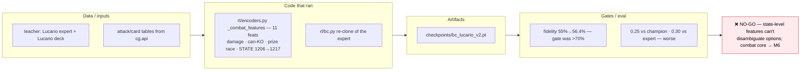

### M4 — deck search ([M4.md](M4.md)) ⚖️
Hill-climb over the Lucario deck's flex slots. Method lessons: noisy small-n ratings promote
losers (openskill evolve rolled back); fitness vs the *mirror* overfits (60% vs seed but worse
vs the field). Honest diverse-field run: seed fitness 0.84, **0/30 mutations improved it** —
the hand-tuned deck was already optimal. (M10 later proved it card-for-card identical to the
leaderboard's dominant list.)

```mermaid
flowchart LR
    subgraph IN4["Data / inputs"]
        A4["seed: tuned Lucario deck — 44 flex slots,<br/>Pokémon core fixed"]
        B4["fitness field: Iono + bc_v1 champion"]
    end
    subgraph RUN4["Code that ran"]
        C4["rl/deck_search.py — mutate_flex · matchup ·<br/>rate_population openskill · evolve · hill_climb"]
        D4["150-game accept test per mutation,<br/>slot-fair engine loop"]
    end
    subgraph ART4["Artifacts"]
        E4["deck variants — one mirror-overfit +1<br/>Heavy Baton + Wally's Compassion"]
    end
    subgraph GATE4["Gates / eval"]
        F4["evolve: noisy small-n promoted a loser — bug"]
        G4M["mirror hill-climb 0.60 vs seed but worse vs field"]
        H4["diverse field: 0/30 mutations beat seed, fitness 0.84"]
    end
    V4["⚖️ deck already optimal — search honest,<br/>nothing to find; bottleneck = field diversity"]
    IN4 --> RUN4 --> ART4 --> GATE4 --> V4
    style V4 fill:#fff8e1,stroke:#f9a825,color:#000
```

### M5 — heuristic tuning + hybrid ([M5.md](M5.md)) ❌
Parameterized the expert's magic numbers: 0/20 proposals beat defaults. Rule-agent +
neural value-head 1-ply override lost at every margin despite 0.92 sign-accuracy — first
sighting of "a win/loss classifier can't rank actions", which recurs in M8.4. Conclusion after
M1–M5: the provided rule agent is a hard ceiling for this toolset on CPU; the untapped signal
is the real leaderboard.

```mermaid
flowchart LR
    subgraph IN5["Data / inputs"]
        A5["sample-agent/main.py magic numbers —<br/>attack scores · energy weights · target priorities"]
        B5["field: Iono + bc_v1 + past variants"]
    end
    subgraph RUN5["Code that ran"]
        C5["sample-agent-tuned/ — weights.json search<br/>hill-climb / CMA-ES via rl.teacher"]
        D5["rl/hybrid.py — rule agent + neural<br/>value-head 1-ply override"]
    end
    subgraph ART5["Artifacts"]
        E5["sample-agent-tuned/ package"]
        F5["checkpoints/hybrid_value.pt — 0.92 sign-acc"]
    end
    subgraph GATE5["Gates / eval"]
        G5M["0/20 weight proposals beat defaults 0.680"]
        H5["hybrid ≤0.46 at every override margin"]
    end
    V5["❌ NO-GO — rule agent is the ceiling;<br/>first sighting of classifier-can't-rank"]
    IN5 --> RUN5 --> ART5 --> GATE5 --> V5
    style V5 fill:#ffebee,stroke:#c62828,color:#000
```

### M6 — generic deck-agnostic pilot ([M6.md](M6.md)) ✅
The pivot: stop specializing, build a pilot that plays ANY deck via deck-blind tier scoring on
the combat core (`rl/generic_pilot.py`, pure-Python `rl/combat.py`, `submission_rules/`
bundle, `tcg/` twins with 202 parity tests). 0.95 vs random, deck-legible (77% ≈ expert's 76%
on Lucario-vs-Iono), but 0.25–0.30 vs the expert. GO for its actual purpose — the reusable
teacher/evaluator — with ship-strength deferred.

```mermaid
flowchart LR
    subgraph IN6["Data / inputs"]
        A6["M3 combat core"]
        B6["1,267-card pool via cards_features.parquet<br/>decks: lucario · iono · floor zero-damage"]
    end
    subgraph RUN6["Code that ran"]
        C6["rl/generic_pilot.py — priority tier scorer<br/>score_play · score_attack · score_card"]
        D6["rl/combat.py split — polars/torch-free"]
        E6["tcg/ twin package + 202 parity tests"]
        F6["rl.export --agent rules · rl.gate ·<br/>build_submission.ps1 -Agent rules"]
    end
    subgraph ART6["Artifacts"]
        G6M["submission_rules/ bundle —<br/>main.py + cg/ + 3-file rl/ + deck.csv"]
        H6["tcg/ package + tests/"]
    end
    subgraph GATE6["Gates / eval"]
        I6["0.95 vs random · floor 0.75"]
        J6["deck legibility 77% ≈ expert's 76%"]
        K6["0.25–0.30 vs expert — below 0.40 gate"]
    end
    V6["✅ GO as THE teacher/evaluator —<br/>shipped rules probe 54474043"]
    IN6 --> RUN6 --> ART6 --> GATE6 --> V6
    style V6 fill:#e8f5e9,stroke:#2e7d32,color:#000
```

### M7 — deck factory loop ([M7.md](M7.md), spec [M7-plan.md](M7-plan.md)) ✅ shipped ×2
The umbrella milestone. Landed: Kaggle ingestion (`rl/kaggle_ingest.py`), deck factory
(template decks did NOT reach human-tuned parity — 0/40), league + matchrunner (anchor
ordering reproduced M6 exactly, n=1600/anchor), race-math L1 ported deck-agnostically,
**turn solver L2** (`rl/turn_solver.py`, within-turn DFS on the engine forward model; A/B
0.533 over greedy, shipped 54586430), encoders v2 + `osv2_bc.pt` (fidelity 0.914 but plays
below teacher), PPO retry with the loss bug fixed (still rise-then-decay — but warm start was
later found confounded). Biggest find: **the play-tier bug** — live PLAY options carry no
`area` field, so trainer scoring never fired in real games since M6. Fixed with 4 more pilot
fixes → best pilot ever (floor 0.930, vs-expert 0.362), shipped 54621283. The L4 go/no-go
review declared the learning evidence confounded → forked into M8.

```mermaid
flowchart LR
    subgraph IN7["Data / inputs"]
        A7["Kaggle episodes — data/kaggle/raw/"]
        B7["data/shells.json · 7-anchor field ·<br/>3,000 generic-teacher BC games"]
    end
    subgraph RUN7["Code that ran"]
        C7["M7.0 rl/kaggle_ingest.py — fetch · parse · cluster"]
        D7["M7.1 rl/deck_build.py generate --n 40"]
        E7["M7.2 rl/matchrunner.py + rl/league.py<br/>M7.2b race-math in rl/combat.py"]
        F7["M7.3 encoders v2 + bc train --arch v2"]
        G7M["M7.4a rl/turn_solver.py — within-turn DFS<br/>M7.4b PPO loss-bug fix in rl/ppo.py"]
        H7["M7.5 rl/postmortem.py + tcg.shipping export/gate"]
    end
    subgraph ART7["Artifacts"]
        I7["episodes.parquet · opp_decks.parquet · meta_v1/"]
        J7["decks/gen/ 40 candidates · data/league/"]
        K7["osv2_bc.pt · ppo_m75_it49.pt"]
        L7["subs 54586430 · 54616196 · 54621283"]
    end
    subgraph GATE7["Gates / eval"]
        M7N["factory: 0/40 decks above anchor median"]
        N7["solver A/B 0.533 over greedy, p≈0.008"]
        O7["BC v2 val 0.914 but G3 0.44 — not shippable"]
        P7["play-tier bug found → 5 pilot fixes<br/>final floor 0.930 · vs-expert 0.362"]
    end
    V7["✅ SHIPPED ×2 — solver pilot becomes the<br/>campaign opponent; PPO confounded → fork M8"]
    IN7 --> RUN7 --> ART7 --> GATE7 --> V7
    style V7 fill:#e8f5e9,stroke:#2e7d32,color:#000
```

### M8 — beat-the-ship campaign ([M8.md](M8.md), report [M8-report.md](M8-report.md)) ❌ bar not cleared
Bar: ≥0.55 vs `solver:lucario` n≥800. M8.0 reset the instruments and measured the loss
taxonomy (attach-off-racer 55/100 ≫ hand-discard 38 > Boss's-Orders-hoarded 21). Results:
**M8.2 BC refresh ✅** — re-cloning the FIXED teacher gave `osv2_bc2.pt` **0.345** (+10.8pp
with zero RL; the single biggest finding). **M8.1 dev-tier solver ❌** killed (pooled 0.492,
n=1600). **M8.3 PPO probe ⚖️** — entropy diffusion cured, but peak verifies to **0.359**
(+1.4pp = noise): more PPO is a measured dead end. **M8.4** — L3 archetype determinizer ✅
(top-1 1.000 by turn 2), value on search states ✅ (sign-acc 0.57→0.85), but the **sims ladder
is FLAT ❌** (0.515/0.490/0.495 at 16/32/64): inference-time MCTS on this value head is a
dead end. M8.5 recommended NO-GO on AlphaZero-lite for this budget.

```mermaid
flowchart LR
    subgraph IN8["Data / inputs"]
        A8["fixed teachers: generic + solver pilots"]
        B8["env.toJSON game dumps for taxonomy"]
    end
    subgraph RUN8["Code that ran"]
        C8["M8.0 rl/postmortem.py batch — loss taxonomy"]
        D8["M8.1 dev-tier solver in rl/turn_solver.py"]
        E8["M8.2 rl/bc.py re-clone of the FIXED teacher"]
        F8["M8.3 rl/ppo.py probe + --shaping race/dev"]
        G8M["M8.4 rl/determinize.py + rl/value_train.py<br/>+ mcts: sims ladder"]
    end
    subgraph ART8["Artifacts"]
        H8["osv2_bc2.pt — 0.345, new BC base"]
        I8["ppo_m83_legB_it5.pt — 0.359, best neural"]
        J8["data/bc_v2b/ · data/bc_v2_solver/ ·<br/>bc_v1_value_search.pt · docs/M8-report.md"]
    end
    subgraph GATE8["Gates / eval"]
        K8["taxonomy: attach-off-racer 55/100 ≫<br/>hand-discard 38 &gt; trainer-hoarded 21"]
        L8["dev tier killed 0.492 n=1600"]
        M8N["BC refresh +10.8pp — biggest finding"]
        N8["PPO peak +1.4pp = noise · sims ladder FLAT"]
    end
    V8["❌ bar not cleared — 0.359 &lt; 0.55<br/>pinned baselines + 3 dead ends recorded"]
    IN8 --> RUN8 --> ART8 --> GATE8 --> V8
    style V8 fill:#ffebee,stroke:#c62828,color:#000
```

### M9 — pilot-fix + learning ladder ([M9.md](M9.md), spec [M9-plan.md](M9-plan.md)) ⚖️ closed
Restored 2026-07-16 as lead track, closed 07-16 with no ship: **every one of its own legs was
killed**, but Leg 0's external-agent probe found the milestone's real payload — the buddy agent
at **0.615 mirror / 0.578 meta**, far above anything we had. That reframed the campaign: the
next several milestones are about reproducing buddy-like behavior with a learned policy (M11
onward), and the `ext:` spec plus [buddy-analysis.md](buddy-analysis.md) are what M9 handed
forward. The plan as written was: **Leg 1 (lead):** pilot v2 fixes behind a default-off
`fixes` flag — Fix A hand-discard (Carmine burned t1, 38/100) + Fix B gust (Boss's Orders
hoarded, 21/100); `solver2:` vs `solver:` gate ≥0.53 at n=400, can clear the bar outright.
**Leg 2 (top learning rung):** DAgger on the solver — the strongest *observable and
queryable* teacher — student states, teacher labels → `osv2_dagger1.pt` (gate on win-rate
progress, never fidelity). Then Leg 3 disagreement-weighted distillation, Leg 4
value-as-ranker probe (offline-gated), Leg 5 gated KL-PPO + AZ-lite (Piotr sign-off).

```mermaid
flowchart LR
    subgraph IN9["Data / inputs — planned"]
        A9["teacher: solver — observable AND queryable"]
        B9["warm start osv2_bc2.pt ·<br/>data/bc_v2b + new data/bc_dagger"]
    end
    subgraph RUN9["Code to run — planned"]
        C9["Leg 1: fixes flag in rl/generic_pilot.py +<br/>rl/turn_solver.py → solver2: spec"]
        D9["Leg 2: rl/bc.py collect_dagger —<br/>student picks, solver labels"]
        E9["Leg 3: solver_diff column + weighted CE W=10"]
        F9["Leg 4: score_siblings + pairwise ranking head"]
        G9M["Leg 5 gated: KL-PPO + AZ-lite — Piotr sign-off"]
    end
    subgraph ART9["Artifacts — planned"]
        H9["osv2_dagger1.pt · osv2_soldis1.pt ·<br/>bc_v1_rank.pt · ppo_m9_kl.pt"]
        I9["docs/M9.md diary · runs/m9_*.jsonl"]
    end
    subgraph GATE9["Gates"]
        J9["Leg 1 go ≥0.53 · imitation legs go ≥0.375"]
        K9["promotion: ≥0.55 pooled n≥1200, both seeds<br/>&gt;0.52 + floors + meta_v2 co-gate"]
    end
    V9["⚖️ CLOSED — own legs killed; Leg 0 found<br/>buddy 0.615 mirror / 0.578 meta → the M11+ target"]
    IN9 --> RUN9 --> ART9 --> GATE9 --> V9
    style V9 fill:#fff8e1,stroke:#f9a825,color:#000
```

### M10 — clone the leaderboard ([M10.md](M10.md)) ❌ NO-GO
The one beyond-teacher path: imitate 600–1345-scoring teams from Kaggle episode replays.
Built the snowball harvest (2,123 episodes, 236,446 decisions, 3,619 teacher seats ≥550) and
the replay→shard converter with G0/G1 gates. Both recipes died at G3 (fine-tune 0.318,
elite-only 0.292, vs base 0.345): elite fidelity **saturated at 0.527** — the same signature as
the retired rule-pilot teacher. Generalized dead end: **BC from replays of agents whose
reasoning is search/hidden-state (unobservable)**. Keepers: harvest infra, converter, the
**meta_v2 co-gate** (ship 0.448 · osv2_bc2 0.405), and proof our deck IS the meta (~89%
Lucario mirrors at the top; dominant list diffs empty vs `decks/lucario.csv`).

```mermaid
flowchart LR
    subgraph IN10["Data / inputs"]
        A10["Kaggle leaderboard teams scoring 600–1,345"]
        B10["warm start osv2_bc2.pt ·<br/>self-play corpus data/bc_v2b 200k decisions"]
    end
    subgraph RUN10["Code that ran"]
        C10["kaggle_ingest leaderboard · targets ·<br/>refresh --opp-subs — snowball harvest"]
        D10["rl/replay_bc.py — audit · roundtrip ·<br/>build --min-score 550 / 800 · meta-eval"]
        E10["rl/bc.py train — multi-dir · --init · --weighting"]
        F10["rl/matchrunner.py play — G3 screens seeds 716/717"]
    end
    subgraph ART10["Artifacts"]
        G10M["2,123-episode cache, 172MB"]
        H10["data/bc_kaggle/ 236k decisions ·<br/>data/bc_kaggle_elite/ 34k"]
        I10["osv2_kbc1.pt · osv2_kbc2.pt ·<br/>data/kaggle/meta_v2/ frozen pool"]
    end
    subgraph GATE10["Gates / eval"]
        J10["G0 PASS · G1 roundtrip 1.0000 — 722/722"]
        K10["G2 offline 0.651→0.691 PASS"]
        L10["G3 KILLS: A 0.318 · B′ 0.292 vs 0.345 base"]
        M10N["elite fidelity saturates 0.527 — mechanism"]
    end
    V10["❌ NO-GO — unobservable teachers; keepers:<br/>harvest · converter · meta co-gate · deck=meta"]
    IN10 --> RUN10 --> ART10 --> GATE10 --> V10
    style V10 fill:#ffebee,stroke:#c62828,color:#000
```

### M11 — learned turn-planning ([M11.md](M11.md), spec [M11-plan.md](M11-plan.md)) ⚖️
The first attempt to make plan coherence *learned* rather than hand-coded: `solve_turn_line`
emits per-step observations, `rl/plan.py` adds a PLAN_DIM=27 block, and `OptionScorerV3`
scores plans-as-options alongside actions. Rung 0 gated at **0.278** and a protocol fix (plan
once per turn, then hold) only reached 0.328 — the cause was label quality, not architecture:
the "expert" was the solver with its override bars *bypassed*. Relabelling with bar-honoring
semantics (label = `line[0]` only above `MIN_OVERRIDE_SCORE`, else greedy + null plan) lifted
null-plan rate 0.57→0.93 and derails 422→60, and `osv3_plan0c` gated **0.415** (n=400 seed 1,
confirmed 0.415 at n=800 seed 2, pooled 0.415 n=1200) — the campaign's best neural checkpoint
at the time, +7pp over `osv2_bc2`. Expert iteration on top then died twice: round 1 **0.314**
(per-prompt Gumbel noise stacked on τ=1.0 + Dirichlet, trained on junk states), redesigned
round 2 **0.357** — two consecutive misses vs the 0.445 gate killed the EI ladder. A later
live-observation round on 54779834 confirmed a Solrock over-attach bug, but all three
inference-time guards (0.359 / 0.372 / 0.385) were killed and reverted.

```mermaid
flowchart LR
    subgraph IN11["Data / inputs"]
        A11["teacher: widened solve_turn_line 2.0s<br/>bars bypassed → bar-honoring"]
        B11["warm start osv2_bc2.pt via load_v2_into_v3"]
        C11["data/bc_v2b · league population.json"]
    end
    subgraph RUN11["Code that ran"]
        D11["rl/plan.py — PLAN_DIM 27 (+risk/trade 23:27)"]
        E11["rl/plan_iter.py collect --mode expert|ei · train"]
        F11["rl/policy.py OptionScorerV3 — plan_logits"]
        G11M["rl/matchrunner.py play — v3 model: branch"]
    end
    subgraph ART11["Artifacts"]
        H11["osv3_plan0 · 0b · 0c · osv3_ei1 · osv3_ei2"]
        I11["data/plan_ei0b · plan_ei2<br/>(plan_ei0, plan_ei1 quarantined)"]
        J11["runs/m11_r0c_s1.jsonl · m11_r0c_s2.jsonl"]
    end
    subgraph GATE11["Gates / eval"]
        K11["coverage ≥0.85: 0.952 / 0.993 PASS"]
        L11["Rung 0 KILL 0.278 → 0.328 → 0.325"]
        M11N["Rung 0'' 0.415 GO · pooled 0.415 n=1200"]
        N11["EI ≥0.445: 0.314 · 0.357 KILL ×2"]
        O11["meta co-gate 0.406"]
    end
    V11["⚖️ +7pp over BC, below ship bar —<br/>plan infra kept, EI ladder dead"]
    IN11 --> RUN11 --> ART11 --> GATE11 --> V11
    style V11 fill:#fff8e1,stroke:#f9a825,color:#000
```

### M12 — value-as-ranker ([M12.md](M12.md), spec [M12-plan.md](M12-plan.md)) ❌ NO-GO
M9's Leg 4, run on the M11 stack: `score_siblings` (one-ply expansion + shared-budget `_dfs`
per root candidate) feeds `rl/rank.py`, which collects from greedy on-distribution self-play
and trains a pairwise-logistic head at RANK_MARGIN=200; the `rank:` pilot then overrides the
solver when confident (CONF_MARGIN 1.0). Collection gave 400 games / 12,685 ranked prompts /
~43.9k margin pairs in ~14 min. **Gate 1 passed decisively — held-out pairwise accuracy
0.873 vs a 0.70 bar**, settling the long-running M8.4 question: "a value head can't rank
siblings" was a *loss-function* problem, not an architecture problem. Gate 2 killed it anyway:
the `rank:` pilot scored **0.383** (153W-247L, n=400) against a 0.415 kill line and a 0.500
mirror null — the overrides cost ~12pp. The ranker reproduces the search's preferences almost
perfectly, and those preferences still lose, which triangulated the real bottleneck with M8.1
(0.314) and M11's flat EI rounds: **`score_leaf`'s development scoring is not an improvement
signal on non-lethal turns**. A latent `_dev_facts` crash on turn-passed leaves (hand is None
for the non-observer side, masked by `make_solver_pilot`'s exception swallowing) was fixed en
route — the same swallow-pattern that would cost M17 a whole milestone.

```mermaid
flowchart LR
    subgraph IN12["Data / inputs"]
        A12["teacher: widened solve_turn_line sibling scores"]
        B12["greedy solver self-play states (on-distribution)"]
        C12["warm start: none — fresh V3-shaped net, plan=zeros"]
    end
    subgraph RUN12["Code that ran"]
        D12["rl/turn_solver.py::score_siblings"]
        E12["rl/rank.py collect · train (pairwise logistic)"]
        F12["rl/matchrunner.py play --a rank:..."]
    end
    subgraph ART12["Artifacts"]
        G12M["checkpoints/osv3_rank1.pt"]
        H12["data/rank1 — 12,685 prompts · ~43.9k pairs"]
        I12["runs/m12_g2_s1.jsonl · tests/test_rank.py"]
    end
    subgraph GATE12["Gates / eval"]
        J12["Gate 1 pairwise acc ≥0.70: 0.873 PASS"]
        K12["Gate 2 wr ≥0.445 / kill &lt;0.415: 0.383 KILL"]
        L12["null reference: 0.500 mirror → overrides ≈ −12pp"]
    end
    V12["❌ NO-GO — ranking loss works,<br/>score_leaf is the bottleneck"]
    IN12 --> RUN12 --> ART12 --> GATE12 --> V12
    style V12 fill:#ffebee,stroke:#c62828,color:#000
```

### M13 — outcome-grounded setup value ([M13.md](M13.md), spec [M13-plan.md](M13-plan.md)) ⚖️
If `score_leaf`'s heuristic tail is the bottleneck, replace it with something learned from
actual game outcomes. Rung 0 landed CONDITIONAL_ATTACKS (Solrock/Lunatone card facts threaded
through both combat twins), collected 2,000 games → 27,621 setup states, and trained on
**matched pairs** — same turn bucket, same prize counts, same matchup — to held-out
matched-pair accuracy **0.704** vs a 0.62 GO bar. The user-run 10k-game safari
(`m13_collect.sh --target 10000`: 138,247 setup states, 86 shards) then lifted that to
**0.768**, with the setup phase t4–15 at 0.79–0.80 — clean data-scaling, and the milestone's
durable asset. The consumer died three times: threading `leaf_value` into `score_leaf`/`_dfs`
gave **0.458**; recalibrating the override margin from the heuristic-era 900 to **200**
(smallest LAMBDA·|ΔV| gap with ordering accuracy ≥0.80) gave **0.484**; the turn-gated variant
gave **0.453** — all at or below the 0.500 mirror null. Together with M8.1 and M12 that is
five measurements across three milestones, and it hardened into a campaign law: **override-style
consumption of any evaluation signal on non-lethal turns does not work — the greedy tier system
is locally optimal against itself.** The value was proven; only its consumer was dead, which set
up M14.

```mermaid
flowchart LR
    subgraph IN13["Data / inputs"]
        A13["self-play states at live budgets + outcome labels"]
        B13["warm trunk osv3_plan0c (value pathway, plan=0)"]
        C13["data/setupval — 2k then 10k games, 86 shards"]
        D13["CONDITIONAL_ATTACKS facts (Solrock/Lunatone)"]
    end
    subgraph RUN13["Code that ran"]
        E13["rl/setup_value.py collect · train (matched pairs)"]
        F13["m13_collect.sh --target 10000 — safari pipeline"]
        G13M["rl/turn_solver.py leaf_value / dev_margin"]
        H13["rl/matchrunner.py play --a vsolver:..."]
    end
    subgraph ART13["Artifacts"]
        I13["osv3_setupval1.pt · osv3_setupval2.pt"]
        J13["data/setupval — 138,247 setup states"]
        K13["runs/m13_s1{,v2,v3}_screen.jsonl"]
    end
    subgraph GATE13["Gates / eval"]
        L13["V0 matched-pair ≥0.62: 0.704 GO → 0.768"]
        M13N["S1 v1 (go ≥0.53 / kill ≤0.50): 0.458 KILL"]
        N13["S1 v2 margin 200: 0.484 KILL"]
        O13["S1 v3 turn-gated: 0.453 KILL — null 0.500"]
    end
    V13["⚖️ value proven, override consumer dead ×3;<br/>the override law"]
    IN13 --> RUN13 --> ART13 --> GATE13 --> V13
    style V13 fill:#fff8e1,stroke:#f9a825,color:#000
```

### M14 — value feeds the PLANNER ([M14.md](M14.md), spec [M14-plan.md](M14-plan.md)) 🔭
The correct consumer for M13's value: not an override at play time, but **plan-head training
targets** — so the plan head learns what to *build* on the ~93% of turns that were previously
plan-blind. The collector gained an `--opponents` rotation (solver mirror / `ext:` buddy /
`rule:lucario`, teacher seat recorded only vs externals per M10's no-third-party-imitation ban)
and a `--value-ckpt` setup-plan commit path (margin 200, turn <32). Collection hung on one
worker stuck ~2.5h in a never-terminating external matchup — killed by exact PID, 730/800 games
kept, and a **runaway-game cap** (600 prompts → draw) added as the durable fix. `osv3_plan2`
trained to val_acc 0.896 / plan_acc 0.932 and **shipped as 54790886 with the win-rate gate
user-waived** as an observation run; for the record it measured *below* baseline (mirror
**0.383** vs plan0c 0.415, meta **0.403** vs 0.406, LB settled 427.3). The real payload came
from the observation round: a behavioral diff over live replays showed attaches to *saturated*
recipients rising 0.51 → 0.63 and Solrock-fed-without-Lunatone 0.9 → 1.8/game, diagnosing
**energy waste as the dominant defect** and root-causing it to MAIN-phase `score_attach` never
receiving `board_ids`. Fixing it in both twins made `solver:lucario` — the canonical opponent —
about 6pp stronger, invalidating every pre-fix pin in the campaign.

```mermaid
flowchart LR
    subgraph IN14["Data / inputs"]
        A14["osv3_setupval2 value ckpt (12-id, margin 200)"]
        B14["warm start osv3_plan0c.pt"]
        C14["data/plan_m14 + plan_ei0b + bc_v2b"]
        D14["opponents: solver mirror · ext:buddy · rule:lucario"]
    end
    subgraph RUN14["Code that ran"]
        E14["rl/plan_iter.py collect --opponents --value-ckpt"]
        F14["rl/plan_iter.py train (5ep 1e-4)"]
        G14M["tcg.shipping export · gate --agent neural"]
        H14["build_submission.sh"]
    end
    subgraph ART14["Artifacts"]
        I14["osv3_plan2.pt (val_acc 0.896 / plan_acc 0.932)"]
        J14["data/plan_m14 — 730/800 games"]
        K14["runs/m14_record_s1.jsonl · monitor MODELS row"]
    end
    subgraph GATE14["Gates / eval"]
        L14["technical gates green; win-rate gate WAIVED"]
        M14N["mirror 0.383 (plan0c 0.415) — regression"]
        N14["meta co-gate 0.403 (plan0c 0.406) · LB 427.3"]
        O14["observation: saturated-attach 0.51 → 0.63"]
    end
    V14["🔭 SHIPPED 54790886 as observation run —<br/>found+fixed the energy-waste teacher bug"]
    IN14 --> RUN14 --> ART14 --> GATE14 --> V14
    style V14 fill:#e3f2fd,stroke:#1565c0,color:#000
```

### M15 — the net finally sees its hand ([M15.md](M15.md), spec [M15-plan.md](M15-plan.md)) 🔭
`encode_state_v3` extends the state to **20 ids** (12 board + 8 sorted, zero-padded hand-card
ids), `OptionScorerV3` becomes parameterized on `n_state_ids`, and `load_v3_into_v3h` migrates
zero-init so hand-aware-with-zero-hand ≡ the old net — the warm-start invariant's third use.
The honest re-pin landed first and cost 5.8pp on paper: `osv3_plan0c` scores **0.357** against
the *post*-attach-fix `solver:lucario`, confirming the canonical opponent's ~6pp gain. Collection
ran clean for the first time in three milestones — 800/800 games, 30,192 states, no hung workers
— and `osv3h_plan1` screened **0.384** (+2.7pp over the honest 0.357 re-pin) with a meta co-gate
of **0.419**, the best neural meta to that point. Shipped as **54793851**, the first hand-aware
bundle (1708-wide `state_enc`, 3.57MB), later settling at 422.9. Two gotchas pinned here still
matter: the raw screen jsonl codes **0=WIN** (naively summing reads 0.620 and is wrong), and a
fresh Kaggle submission's 600.0 is the starting μ, not a result.

```mermaid
flowchart LR
    subgraph IN15["Data / inputs"]
        A15["warm start osv3_plan0c via load_v3_into_v3h"]
        B15["data/plan_m15 — 800 games, 30,192 states"]
        C15["legacy 12-id shards via pad shim"]
        D15["fixed teacher (post score_attach fix)"]
    end
    subgraph RUN15["Code that ran"]
        E15["rl/encoders.py encode_state_v3 (N_HAND_IDS=8)"]
        F15["rl/policy.py OptionScorerV3(n_state_ids=...)"]
        G15M["rl/plan_iter.py collect · train (5ep 1e-4)"]
        H15["tcg/shipping.py gate · build_submission.sh"]
    end
    subgraph ART15["Artifacts"]
        I15["osv3h_plan1.pt — 1708-wide state_enc, 3.57MB"]
        J15["runs/m15_repin_plan0c.jsonl"]
        K15["runs/m15_screen_s1.jsonl · m15_meta_s1.log"]
    end
    subgraph GATE15["Gates / eval"]
        L15["re-pin plan0c 0.357 (n=400, post-fix solver)"]
        M15N["mirror 0.384 = 153W/246L/1D, +2.7pp"]
        N15["meta_v2 0.419 — best neural to date"]
        O15["technical gates green (re-verified post-crash)"]
    end
    V15["🔭 SHIPPED 54793851 — hand-aware,<br/>honest +2.7pp; LB settled 422.9"]
    IN15 --> RUN15 --> ART15 --> GATE15 --> V15
    style V15 fill:#e3f2fd,stroke:#1565c0,color:#000
```

### M16 — see WHICH card an option plays ([M16.md](M16.md), spec [M16-plan.md](M16-plan.md)) ✅
Replay forensics over 31 episodes of 54793851 indicted a defect present since v1 and never
diagnosed: PLAY options carry only a hand index, so `encode_option` produced **byte-identical
vectors for "Play Boss's Orders" and "play Poké Pad"** — 431/1353 live decision states (~14/game,
32%) offered ≥2 indistinguishable trainers — and ATTACK options never encoded `attackId`. Worse,
**all 5,628 PLAY labels in plan_m15 had acted-id 0**: identity was discarded at collection, so a
re-collect was mandatory. The v3o fix resolves the played card from `hand[opt.index]` into the
acted-card FEAT block plus an embedding id, and appends `N_OPTION_EXTRA = 4` identity features
(printed dmg/300, cost/5, effective dmg vs opp active/300, number/10), keeping
`encode_option_v2_legacy` selected by sniffed checkpoint width so pinned baselines stay
reproducible. Trained on a deliberately **clean mix — plan_m16 + plan_m15 only**, dropping the
pre-attach-fix energy-waste corpora — `osv3o_plan1` delivered the campaign's biggest single
jump: mirror **0.427/0.421 → 0.424 pooled n=800** and meta_v2 **0.534**, +11.5pp over the prior
neural best and the **first neural score above 0.5 on the 0.90-weight `mega_lucario_ex+solrock`
archetype** (0.517). Shipped as **54801291**, settled **519.8**. Watch-list answers were honest
about what did *not* move: energy waste was not unlearned (saturated-attach 0.49 vs plan0c 0.50).

```mermaid
flowchart LR
    subgraph IN16["Data / inputs"]
        A16["forensics: 31 eps of 54793851 (12W ≈ 0.39 live)"]
        B16["warm start osv3h_plan1 via load_v3h_into_v3o"]
        C16["clean mix: data/plan_m16 + data/plan_m15 ONLY"]
        D16["data/external/buddy durable bundle copy"]
    end
    subgraph RUN16["Code that ran"]
        E16["rl/encoders.py encode_option_v2 / _v2_legacy"]
        F16["rl/policy.py option_dim_of(sd) width sniff"]
        G16M["rl/plan_iter.py collect · train --init-v3o"]
        H16["forensic_m16.py · label_audit_m16.py"]
    end
    subgraph ART16["Artifacts"]
        I16["osv3o_plan1.pt (val_acc 0.769 / plan_acc 0.845)"]
        J16["data/plan_m16 — 26,415 states, all PLAY ids resolved"]
        K16["runs/m16_screen_s1.jsonl · _s2.jsonl · m16_meta_s1.log"]
    end
    subgraph GATE16["Gates / eval"]
        L16["mirror 0.427 s1 / 0.421 s2 → 0.424 pooled n=800"]
        M16N["vs v3h_plan1 0.384 · plan0c 0.357 (+4pp)"]
        N16["meta_v2 0.534 (prev 0.419, +11.5pp)"]
        O16["lucario+solrock 0.517 — first neural &gt;0.5"]
    end
    V16["✅ SHIPPED 54801291 — biggest gain of the<br/>campaign; LB settled 519.8"]
    IN16 --> RUN16 --> ART16 --> GATE16 --> V16
    style V16 fill:#e8f5e9,stroke:#2e7d32,color:#000
```

### M17 — value-first 10k scale-up ([m17_portmortem.md](m17_portmortem.md)) 🔴 killed
The approved safari: 10k games collected with the new 20-id value net as setup-plan teacher,
then retrain the option-identity policy. Offline metrics improved dramatically — val_acc
0.769 → **0.899**, plan_acc 0.845 → 0.968 — and live play regressed on **every** axis: mirror
**0.380** pooled n=800 (vs champion 0.424), meta **0.396/0.404** (vs 0.534), head-to-head vs
plan1 only **0.400**. The 0.90-weight `mega_lucario_ex+solrock` archetype collapsed to 0.367
from M16's 0.517 and single-handedly sank the meta score. The smoking gun was a counter:
M16 committed 2,420 SETUP plans in 800 games (~3.0/game); M17b committed **0 across 10,000
games**. The postmortem blamed value-net miscalibration against the margin-200 gate — **that
hypothesis was retracted in M18**, which found the real cause: an encoder-width bug feeding
12-id states to a 20-id net, with the exception swallowed. NO-SHIP; the gate correctly blocked
a −4.4pp mirror regression, and the champion stayed at M16's 54801291.

```mermaid
flowchart LR
    subgraph IN17["Data / inputs"]
        A17["data/plan_m17b — 50 shards, 10k games"]
        B17["data/plan_m17 — 32 shards, 6.4k games"]
        C17["data/plan_m16 — 800 games"]
        D17["osv3o_setupval1.pt value teacher (20-id, acc 0.800)"]
    end
    subgraph RUN17["Code that ran"]
        E17["rl/plan_iter.py leaf_value · value_solve"]
        F17["rl/bc.py train — 10k expert imitation"]
        G17M["rl/matchrunner.py mirror screens + h2h"]
        H17["forensic_m16.py"]
    end
    subgraph ART17["Artifacts"]
        I17["checkpoints/osv3o_plan2.pt — NO-SHIP"]
        J17["runs/m17_screen_s1.jsonl · _s2.jsonl"]
        K17["runs/m17_meta_plan2.log · m17_h2h.jsonl"]
    end
    subgraph GATE17["Gates / eval"]
        L17["mirror pooled n=800 0.380 KILL (champ 0.424)"]
        M17N["meta_v2 0.404 / 0.396 KILL (champ 0.534)"]
        N17["h2h vs plan1 0.400 (160W/240L) KILL"]
        O17["SETUP plans committed: 0 in 10,000 games"]
    end
    V17["🔴 NO-SHIP — offline +13pp, live −4.4pp;<br/>root cause found only in M18"]
    IN17 --> RUN17 --> ART17 --> GATE17 --> V17
    style V17 fill:#ffebee,stroke:#c62828,color:#000
```

### M18 — fix the value teacher ([m18.md](m18.md)) 🔭 shipped
Forensics overturned M17's postmortem outright. `leaf_value` (`rl/plan_iter.py:73`) hard-coded
`encode_state_v2` (12 ids, 1580-wide) while `osv3o_setupval1.pt` is 20-id (1708-wide), so every
call raised `RuntimeError` — swallowed by a bare `except Exception: pass` at
`rl/plan_iter.py:99`. `value_solve` always returned `(None, None)`; **the value net was never
evaluated once**, and M17's regression was pure volume dilution. The fix dispatches on
`vnet.n_state_ids` and adds the instrumentation whose absence hid it for a milestone:
`vs_calls`/`vs_errors` counters with tracebacks, margin percentile reporting, a `--vs-margin`
flag, a `weights` shard column, and a `relabel` subcommand. Re-collection confirmed it — 800
games, **SETUP 2843 = 3.55/game, vs_errors 0**. Of four candidates, offline
disagreement-weighted DAgger (`plan4`, W=10) was **killed at 0.2775**, −15pp; `plan3` (m18+m16)
posted the best mirror screen in campaign history (**0.4844 pooled**) but its meta collapsed to
0.378; `plan5` (m18+m16+m15) won on the axis that matters, mirror 0.4294 pooled with meta
2-seed **~0.498 vs champion ~0.465**. That comparison only became visible because re-measuring
the champion revealed **its own pinned gates were seed-stale** — the champion's meta seed 1 is
0.395 and it fails both of its own floors. Piotr shipped plan5 as **54817441**. The durable law:
*every gate baseline must be 2-seed pooled.*

```mermaid
flowchart LR
    subgraph IN18["Data / inputs"]
        A18["data/plan_m18 — 800 games, SETUP 2843, vs_errors 0"]
        B18["data/plan_m16 · data/plan_m15 (meta regularizer)"]
        C18["data/plan_m16_w · plan_m15_w (W=10 relabel)"]
        D18["osv3o_setupval1.pt — 20-id, now actually running"]
    end
    subgraph RUN18["Code that ran"]
        E18["rl/plan_iter.py leaf_value encoder dispatch"]
        F18["vs_calls/vs_errors + margin p10/50/90/99 + --vs-margin"]
        G18M["rl/bc.py relabel · weighted policy-CE"]
        H18["build_submission.sh --checkpoint osv3o_plan5.pt"]
    end
    subgraph ART18["Artifacts"]
        I18["osv3o_plan3 · plan4 · plan5 · plan6 .pt"]
        J18["runs/m18_collect.log · m18_relabel.log"]
        K18["runs/m18a_screen_s1.jsonl · m18b{,2,3}_meta.log"]
    end
    subgraph GATE18["Gates / eval"]
        L18["plan4 (offline DAgger W=10) 0.2775 KILL"]
        M18N["plan3 mirror 0.4844 PASS · meta 0.378 KILL"]
        N18["plan5 mirror 0.4375/0.4213 = 0.4294 pooled"]
        O18["plan5 meta 2-seed ~0.498 vs champ ~0.465"]
    end
    V18["🔭 SHIPPED 54817441 (Piotr call) —<br/>champion's pins were seed-stale"]
    IN18 --> RUN18 --> ART18 --> GATE18 --> V18
    style V18 fill:#e3f2fd,stroke:#1565c0,color:#000
```

### M18.1 — the accidental deck swap 🔭 shipped
Piotr spotted Mega Abomasnow ex in live replays of a bundle that was supposed to be piloting
Lucario. Three things lined up: `tcg/shipping.py` carries an M1-era fossil
`DEFAULT_DECK = "kyogre"`, `build_submission.sh` passes `--deck` only when given, and
`decks/kyogre.csv` is a water deck whose ace is 4× Mega Abomasnow ex — the M1 "don't trust deck
file names" trap, again. A `dist/` tarball audit by `deck.csv` md5 showed M11/M14/M15 bundles
were Lucario (those builds passed `--deck` explicitly) while **M16's 54801291 was the first
kyogre/abomasnow bundle** — the flag was dropped during that session's dry-build firefight and
the omission was then codified into the train-ship skill, so M18 inherited it. No gate caught
this, because the ship gate only checks bundle *self*-consistency while all offline measurement
pairs the net with `:lucario` via spec strings outside the bundle. Re-shipping plan5 with an
explicit `--deck lucario` as **54817813**, 37 minutes later, created an accidental clean A/B on
the deck variable. The audit also reframed the record: **M16→M18 is the clean same-deck net A/B;
M15→M16 is the confounded pair**, so M16's 422.7→519.8 jump may be substantially deck, not
encoder.

```mermaid
flowchart LR
    subgraph IN181["Data / inputs"]
        A181["decks/kyogre.csv — actually 4× Mega Abomasnow ex"]
        B181["decks/lucario.csv — the measured pairing"]
        C181["dist/ tarball audit — deck.csv md5 per bundle"]
        D181["live replays ep 86653767 (M16) · ep 86776210 (M18)"]
    end
    subgraph RUN181["Code that ran"]
        E181["tcg/shipping.py DEFAULT_DECK = kyogre (fossil)"]
        F181["build_submission.sh — DECK='' , --deck optional"]
        G181M["notebooks/model_monitor.ipynb replay audit"]
    end
    subgraph ART181["Artifacts"]
        H181["Kaggle 54817813 = plan5 + LUCARIO"]
        I181["Kaggle 54817441 = plan5 + ABOMASNOW (A/B arm)"]
        J181["docs/M19-plan.md replay post-mortem"]
    end
    subgraph GATE181["Gates / eval"]
        K181["bundle deck verified LUCARIO by tarball md5"]
        L181["measured pairing: mirror 0.4294 pooled n=800"]
        M181N["meta 2-seed ~0.498 vs champion ~0.465"]
        N181["M15→M16 now known CONFOUNDED (deck changed)"]
    end
    V181["🔭 SHIPPED 54817813 — never ship without<br/>an explicit --deck"]
    IN181 --> RUN181 --> ART181 --> GATE181 --> V181
    style V181 fill:#e3f2fd,stroke:#1565c0,color:#000
```

### M19 — repair the two piloting defects ([M19.md](M19.md), spec [M19-plan.md](M19-plan.md)) 🔴 killed
Both replay-observed defects turned out to be dual-layer. The greedy teacher scored a saturated
ATTACH tier at a flat 600 with no surplus penalty and its escape tier required lethal already on
board; the encoder gave ATTACH options only the target's printed features and RETREAT a bare
type one-hot. Fixes landed in both twins (saturated tier = 600 + dmg-bonus − 150×min(surplus,3);
retreat tier 2b = 1450 for a ≥2-prize active at hp ≤0.4 with an attack-READY bench; ATTACH and
RETREAT identity extras at unchanged width 94), 469 tests green. But a 40+40-game teacher A/B
showed **the teacher was already mostly clean** (over-attach 0.10 → 0.05/game) — so the live
defect was an *imitation* failure: the net was offered retreat 21×/game and took it 0.11×/game.
Three candidates trained warm from plan5 mapped the trade precisely. `m19a` (no reweight) held
mirror parity at **0.4275 pooled n=800** but the flags did not move at all (retreat 0.07/g).
`m19b` (retreat rows 8×, 2.2% of rows) fixed the behavior outright — **retreat 0.93/g** — and
paid **−3pp** mirror (0.3987). `m19c` (+decline-saturated 4×, 10.4% of rows) moved both axes and
**collapsed to 0.331**, −10pp. The dose-response is the finding: cost scales with the reweighted-row
fraction, generalizing M18's disagreement-weighting dead end into a law about label reweighting
as such. Nothing shipped; champion stayed plan5. A second rule fell out of `m19c` reading 0.475
at n=40 and 0.331 at n=800: **never read strength from a 40-game flag sample.**

```mermaid
flowchart LR
    subgraph IN19["Data / inputs"]
        A19["data/plan_m19 — 800 games seed 3, value-teacher"]
        B19["data/plan_m16 + plan_m15 (meta regularizer)"]
        C19["data/plan_m19_rw · plan_m19_rw2 (reweighted)"]
        D19["warm start + pin: osv3o_plan5.pt"]
    end
    subgraph RUN19["Code that ran"]
        E19["tcg/constants.py score_attach / score_retreat tiers"]
        F19["encode_option_v2 ATTACH+RETREAT extras (width 94)"]
        G19M["rl/plan_iter.py collect · train (rare-class weights)"]
        H19["rl/postmortem.py [over-attach] · main.py NN|{json} log"]
    end
    subgraph ART19["Artifacts"]
        I19["osv3o_m19a.pt · m19b.pt · m19c.pt (none shipped)"]
        J19["runs/m19_collect.log · m19{a,b,c}_train.log"]
        K19["40-game defect-measurement harness"]
    end
    subgraph GATE19["Gates / eval"]
        L19["m19a mirror 0.4275 n=800 = parity, flags unmoved"]
        M19N["m19b mirror 0.3987 (−3pp), retreat 0.93/g FIXED"]
        N19["m19c mirror 0.331 (−10pp) KILL"]
        O19["meta 2-seed all ≈0.46 vs pin ~0.498"]
    end
    V19["🔴 NO-SHIP — behavior↔strength trade quantified;<br/>reweighting dose-response is the law"]
    IN19 --> RUN19 --> ART19 --> GATE19 --> V19
    style V19 fill:#ffebee,stroke:#c62828,color:#000
```

### M20 — PPO revived on V3 ([M20.md](M20.md), spec [M20-plan.md](M20-plan.md)) 🔭 shipped
If label reweighting buys behavior with strength (M19), try RL instead: over-attach as a dense
negative reward, with a KL-anchor to plan5 as the second arm. V3 support was threaded through
the whole PPO stack — `_load_model` v3 sniff, a `plans` shard column, duck-typed `_forward`
dispatch, a KL term in `ppo_update` (both twins), a V3 collector path with a turn-scoped plan
state machine, and an `_is_over_attach` live-obs detector feeding the penalty — 473 tests green.
Two legs ran 8 iters × 400 games from plan5 at lr 3e-5. Verification overturned the in-loop
story completely: leg B measured **0.488 pooled mirror at n=800** (0.469 / 0.507), **+5.9pp over
plan5 and the largest mirror result of the campaign**, while leg A — whose in-loop eval had read
a scary 37.0% — landed 0.481 at n=400. That phantom 13pp "collapse" did not reproduce, which
pinned the rule: **in-loop n=200 evals are promotion triggers only, never evidence.** Meta_v2
2-seed came in at ~0.494, parity with the champion's ~0.498; floors passed with room
(`random:kyogre` 0.920/0.915 — which plan5 actually misses at 0.815/0.870 — and `rule:lucario`
0.341, no regression). The honest caveat is that **the objective it was built for did not move**:
over-attach stayed at 0.72/g vs plan5's ~0.58–0.75, so penalty 0.1 was under-dosed in both arms.
It shipped on strength alone as **54836093**. The larger result is that M8.3's "PPO is dead on
this loop" is now explicitly scoped to v2 nets — **PPO-on-V3 is a live strength lever** — and the
campaign bar remains unmet, 6.2pp short at 0.488.

```mermaid
flowchart LR
    subgraph IN20["Data / inputs"]
        A20["osv3o_plan5.pt — start policy AND frozen KL ref"]
        B20["on-policy rollouts: 400 games/iter × 8 × 2 legs"]
        C20["decks/lucario.csv — learn and eval deck"]
    end
    subgraph RUN20["Code that ran"]
        D20["rl/ppo.py — KL-anchor, V3 _load_model, --tag"]
        E20["rl/collector.py — V3 path, plans col, _is_over_attach"]
        F20["rl/matchrunner.py V3 pilot — verify battery"]
        G20M["build_submission.sh --checkpoint ... --deck lucario"]
    end
    subgraph ART20["Artifacts"]
        H20["ppo_best_m20legB.pt (shipped)"]
        I20["ppo_m20legB_it0005.pt · ppo_current_m20legA.pt"]
        J20["dist/submission_neural_20260719_182911.tar.gz"]
    end
    subgraph GATE20["Gates / eval"]
        K20["legB mirror 0.488 pooled n=800 (0.469/0.507)"]
        L20["legA 0.481 n=400 — in-loop 37.0% did NOT reproduce"]
        M20N["meta_v2 2-seed ≈0.494 vs champion ~0.498 (parity)"]
        N20["floors: random 0.920/0.915 · rule 0.341 PASS"]
        O20["behavior objective UNMOVED: over-attach 0.72/g"]
    end
    V20["🔭 SHIPPED 54836093 (Piotr call) — PPO-on-V3 is<br/>a live strength lever; 0.55 bar still 6.2pp away"]
    IN20 --> RUN20 --> ART20 --> GATE20 --> V20
    style V20 fill:#e3f2fd,stroke:#1565c0,color:#000
```

### M21 — complete observable state + plan-head-in-PPO ([M21.md](M21.md), spec [M21-plan.md](M21-plan.md)) 🔭 shipped ×2 (B2 + B3)
Kicked off 2026-07-19 on `feature/m21`, pinned against champion `ppo_best_m20legB` + lucario
(mirror 0.488, sub 54836093). Step-0 forensics over 22 episodes of the live champion quantified
two defects Piotr spotted in replays, and the numbers are stark: **Boss's Orders was in hand in
136 MAIN states across 16 of 22 games and played exactly zero times**, missing all 27 kill-shot
gust opportunities; retreats were taken 2/25 (92% missed). An encoding-awareness check on a
specific missed retreat (ep 86926859 step 137, active 130/340 vs a full-HP benched twin)
confirmed bench HP and all board ids *are* present in the v3 state vector — **the net is not
blind here, so these are policy failures, not representation failures**, which is a different
diagnosis from M15/M16/M19. The root-cause hypothesis: the plan head has never received a PPO
gradient and plans are selected greedily at collection, so gust plans are never sampled. Scope
follows from that — encoder v4 (logs-derived opponent memory + gap features) with a zero-init
migration of the legB champion, an EI re-baseline behind a non-inferiority Gate A, then PPO legs
B1 (v4 stabilize) / B2 (meta mixture + plan-PPO) / B3 (KL→0). Leg gate baselines are pinned at
**gust-conversion 0/27 = 0.00** and **retreat-conversion 2/25 = 0.08**; B2 promotion requires
strict improvement on gust-conversion. DAgger is demoted to migration-only.

```mermaid
flowchart LR
    subgraph IN21["Data / inputs — planned"]
        A21["champion pin ppo_best_m20legB.pt + decks/lucario.csv"]
        B21["22 live episodes of sub 54836093 (12W–10L)"]
        C21["turn logs → opponent memory + gap features"]
    end
    subgraph RUN21["Code to run — planned"]
        D21["encoder v4 + zero-init migration of legB"]
        E21["EI re-baseline behind Gate A non-inferiority"]
        F21["PPO leg B1 v4 stabilize · B2 meta mixture + plan-PPO"]
        G21M["PPO leg B3 annealed KL→0"]
    end
    subgraph ART21["Artifacts — planned"]
        H21["docs/M21.md diary · m21_forensics.py"]
        I21["v4 checkpoints · opponent-mixture curriculum"]
    end
    subgraph GATE21["Gates"]
        J21["baselines: gust-conversion 0/27 · retreat 2/25"]
        K21["Gate A: EI non-inferior to legB champion"]
        L21["B2 promotion: strict gust-conversion improvement"]
        M21N["campaign bar unchanged: 0.55, n≥800 2-seed pooled"]
    end
    V21["🔭 SHIPPED ×2 — B2 54846434 + B3 54849475<br/>mirror 0.5094 = first neural >0.50"]
    IN21 --> RUN21 --> ART21 --> GATE21 --> V21
    style V21 fill:#e3f2fd,stroke:#1565c0,color:#000
```

**Outcome.** Gate A killed TWICE (0.225 with EI weights, 0.305 uniform — supervised relabel of
a post-PPO checkpoint un-learns its PPO gains at any weighting; Phase A scrapped). B1 killed at
0.457. **B2** (meta-mixture + first-ever plan-head PPO, mirror 0.4894, meta ~0.538) shipped as
54846434; **B3** (KL annealed to 0 → pure self-play, guided gust exploration, plan-tau 1.5)
shipped as 54849475 with **mirror 0.5094 pooled n=800 — the campaign's first neural agent past
0.50 vs the solver** — as a deliberate mirror↔meta live A/B. Two findings aged badly within a
day (see M22): both ship edges were inside instrument noise (z=0.68 / 0.80), and the founding
"never gusts" defect was largely a measurement artifact — 138/142 gust targets were 1-prize and
in 78/142 states the active was also KO-able for equal or more prizes. The durable laws: KL→0
self-play is a strength lever; plan-PPO alone cannot fix a behavior the option head never
samples (two-head deadlock); a behavioral-defect metric must price the opportunity cost of the
action it demands.

### M22 — the endogeneity audit ([M22.md](M22.md), spec [M22-plan.md](M22-plan.md), post-mortem [m22-post-mortem.md](m22-post-mortem.md)) 🔬 diagnosis, no ship
Began as "fix the instrument (M22a), then scale PPO self-play (M22b)" and never got to the
scaling: step-0 forensics found the meta co-gate resolves only 16.3pp (its 0.899-weight cell is
byte-identical to the mirror deck → n_eff 147 of 480 games; **both M21 ship decisions were
noise**, z=0.68/0.80), and then that **every gate opponent was inside the training pool** —
four generations of "gains" were measured against the training distribution. The one doubly
clean opponent we own (never trained against, not authored by us), `rule:dragapult`, delivered
THE campaign finding: **every pilot in our lineage — neural, neural+search, rule+search — sits
at 0.17–0.22 out-of-loop while the company sample agent scores ~0.50 on our exact deck**, and
four generations of mirror gains (0.429→0.509) bought zero of it. Cause A (threat blindness)
confirmed at p<0.0001: dragapult's bench spread lands where the v2/v3 opponent model never
looks (median ⅓ of loss damage on our bench vs 0.000 in the mirror). The loss-anatomy flag
taxonomy died under a win/loss contrast — all phantoms. Instruments that survive: strict
behavior counters (`rl/behavior.py`), the retargeted off-mirror tail gate, MDE refusal gates,
and dragapult as the only out-of-loop floor — evaluation-only, forever.

```mermaid
flowchart LR
    subgraph IN22["Data / inputs"]
        A22["M21 live A/B (B2/B3) + champion pins"]
        B22["meta_v2 manifest + weights"]
        C22["decks/dragapult.csv + company sample agent"]
    end
    subgraph RUN22["Code run"]
        D22["power math on every gate (MDE table)"]
        E22["pool-membership audit of all gate opponents"]
        F22["rl/behavior.py strict counters + pool dedupe"]
        G22["out-of-loop probe battery vs rule:dragapult"]
    end
    subgraph ART22["Artifacts"]
        H22["docs/M22.md diary · m22-post-mortem.md"]
        I22["retargeted tail meta-eval · MDE tables"]
    end
    subgraph GATE22["Findings"]
        J22["meta gate n_eff 147 → 16.3pp MDE"]
        K22["~30pp out-of-loop collapse, all pilots"]
        L22["threat blindness p<0.0001"]
    end
    V22["🔬 DIAGNOSIS — the loop optimized an<br/>endogenous mirror for four generations"]
    IN22 --> RUN22 --> ART22 --> GATE22 --> V22
    style V22 fill:#fff3e0,stroke:#e65100,color:#000
```

### M22c-RL — the one-variable teacher test ([M22.md](M22.md) 07-21 entries, [M22c-morning-report.md](M22c-morning-report.md)) 🔭 shipped (54864190)
The cheapest lever M22 left standing: swap the 45%-of-pool teacher from our 0.22 solver to the
0.50 sample agent (`rule:lucario`), hold everything else at the B3 recipe, 10 PPO iterations.
Out-of-loop did NOT move (+1.68pp vs B3, inside the 5.48pp MDE); shipped anyway on Piotr's call
(slots were free, live signal is the scarce resource) as **54864190** — after first shipping
the kyogre deck by mistake (54864089, M18.1 repeated; `build_submission.sh` now hard-errors
without `--deck` and the md5 ritual is standing). Live forensics at n=39: mirror is a
setup-tempo coin flip; kangaskhan losses are 0–6 shutouts with the hand empty from turn 4 and
Carmine ×3 unplayed — Gap A live on the ladder. The offline kangaskhan cell (0.808, solver-
piloted) vs live (0.30, other teams' pilots) at Fisher p=0.001 sealed the endogeneity story:
**pilot quality dominates archetype in every cell.** C1 within-turn search (+2.25pp, 6.7×
compute, zero actions changed) and C2 threat tiebreak (p=0.548) both nulled. The honest read:
10 iterations was signal-starved, still climbing vs the new teacher — convergence became M23.

```mermaid
flowchart LR
    subgraph IN22c["Data / inputs"]
        A22c["ppo_current_m21legB3.pt warm start"]
        B22c["teacher swap: solver:lucario → rule:lucario"]
    end
    subgraph RUN22c["Code run"]
        C22c["10-iter PPO leg, B3 recipe held fixed"]
        D22c["C1 search probe · C2 threat-tiebreak A/B"]
    end
    subgraph ART22c["Artifacts"]
        E22c["ppo_current_m22cRL.pt · sub 54864190"]
        F22c["--deck hard guard in build_submission.sh"]
    end
    subgraph GATE22c["Gates"]
        G22c["dragapult 0.1888 n=800 (+1.68pp, inside MDE)"]
        H22c["mirror 0.480 · random 0.920 · teacher 0.365"]
    end
    V22c["🔭 LIVE ARM — teacher upgrade alone did not<br/>move out-of-loop in one unconverged leg"]
    IN22c --> RUN22c --> ART22c --> GATE22c --> V22c
    style V22c fill:#e3f2fd,stroke:#1565c0,color:#000
```

### M23 — converge, then audit the signal ([M23.md](M23.md), spec [M23-plan.md](M23-plan.md), audit [m23-signal-audit-plan.md](m23-signal-audit-plan.md)) ✅ resolved, no ship
Three phases, one day. **Phase 0 instruments:** `play_series` seat defect fixed (per-seat
counters recorded the opponent half the time), dragapult hard-guarded out of every training
pool in `parse_pool`, and a seat-correct supporter counter that immediately quantified the
draw-engine gap: from turn 3 the sample agent plays a draw supporter ~2× as often as our model
(0.73–0.80 vs 0.34/turn). **Phase 1, the convergence test:** 20 more iterations against the
strong teacher (30 total on the recipe) — offline vs-teacher **FLAT** (0.3575 vs 0.365) and
dragapult flat (0.151/0.176 vs 0.1888) → the teacher-weakness thesis is dead at convergence;
in-loop promotion evals misled a third time. **Phase 3, the breakthrough:** BC-cloning the
1251-score leaderboard sub 54618168 from 348 harvested replays produced `bc_clone_54618168`
(fidelity 0.664) playing **0.59 vs the sample agent — the first pilot in the campaign to beat
a company agent**, with no plan head, no search, no v4 memory. The same-day **signal audit**
(all thresholds pre-registered) then closed every "fix our side" branch: S2 = supporter↔win
correlation in our own self-play is ~zero/negative (the signal PPO needs is ABSENT from its
data); S3 exploration fine (16.3% ≫ 5%); S5 critic moderate; S6 plan head NOT decorative
(0.90/0.68 plan-consistency); S7 entropy healthy; E1 = a fresh OptionScorerV3 BC-trained on
the clone corpus hits fidelity 0.657 and **0.5625 pooled n=400 vs the sample agent (bar 0.54)
→ architecture exonerated**. The defect is the signal source, and only there.

```mermaid
flowchart LR
    subgraph IN23["Data / inputs"]
        A23["ppo_current_m22cRL.pt + rule:lucario-heavy pool"]
        B23["snowball refresh → 351 episodes of sub 54618168"]
        C23["m23p1 final-iter shards (400 games, stored plans)"]
    end
    subgraph RUN23["Code run"]
        D23["Phase 0: seat fix · dragapult guard · supporter counter"]
        E23["Phase 1: 20-iter convergence leg (vs_teacher promotion)"]
        F23["Phase 3: replay_bc --only-subs → bc_clone train"]
        G23["signal audit S1–S7 + E1 (scripts/m23_signal_audit.py)"]
    end
    subgraph ART23["Artifacts"]
        H23["bc_clone_54618168.pt (0.59) · bc_clone_v3_54618168.pt (0.5625)"]
        I23["S4 adv-by-type logging in rl/ppo.py · audit script"]
    end
    subgraph GATE23["Verdicts (pre-registered)"]
        J23["teacher FLAT 0.3575 · dragapult flat → thesis dead"]
        K23["S2: signal ABSENT/negative in self-play"]
        L23["E1: 0.5625 ≥ 0.54 → architecture EXONERATED"]
    end
    V23["✅ RESOLVED — the bottleneck is the SIGNAL<br/>SOURCE, not architecture/optimizer/exploration"]
    IN23 --> RUN23 --> ART23 --> GATE23 --> V23
    style V23 fill:#e8f5e9,stroke:#2e7d32,color:#000
```

### M24 — the pipeline inversion ([M24-plan.md](M24-plan.md)) 🚧 underway
The audit's conclusion, operationalized: **leaderboard-replay BC becomes the primary training
signal; self-play PPO is demoted to an optional, gated fine-tuner with exogenous clone
opponents.** Piotr's scoping calls (07-21 evening): replay-BC on other teams' public replays
is an approved ship path; the deck question resolves as a **both-decks A/B** (the clone's 60,
hash `9294d9d8…`, vs our lucario 60, hash `20dcd313…` — which is itself the 0.899-weight meta
deck, so strong pilots play OUR exact list on-ladder); corpus expansion now (top-10 subs ≥1140
snowball + `--deck-hash` corpus filter landed); no early clone ship — one ship per milestone,
after identical gate batteries (dragapult primary, MDE discipline). Phase 2, if earned: PPO
fine-tune from the BC base with S4 advantage-by-type logging watching whether credit reaches
card-economy actions, kill-gated against any regression vs the BC base.

```mermaid
flowchart LR
    subgraph IN24["Data / inputs"]
        A24["snowball: top-10 subs ≥1140 + 4 live arms"]
        B24["per-teacher + our-deck-hash corpora"]
    end
    subgraph RUN24["Code to run"]
        C24["V3-as-BC per corpus (plan_iter train, E1 recipe)"]
        D24["A/B: clone-deck arm vs our-deck arm"]
        E24["contingent: PPO fine-tune vs clone opponents"]
    end
    subgraph ART24["Artifacts"]
        F24["docs/M24.md diary · candidate checkpoints"]
    end
    subgraph GATE24["Gates"]
        G24["dragapult n=400×2 PRIMARY · teacher pin 0.5625"]
        H24["random floor · latency · md5 deck ritual"]
    end
    V24["🚧 UNDERWAY — first campaign leg where the<br/>training data provably contains the winning signal"]
    IN24 --> RUN24 --> ART24 --> GATE24 --> V24
    style V24 fill:#e3f2fd,stroke:#1565c0,color:#000
```

## Cross-cutting findings

- **The fidelity law:** agent strength ≈ teacher strength × imitation fidelity — and fidelity
  collapses (~0.53–0.56 ceiling) on teachers whose reasoning is unobservable (rule-pilot
  `AttackPlan`, M3; leaderboard replays, M10).
- **Teacher rule (settled 07-14, strengthened by M10):** pick the strongest teacher whose
  reasoning is **observable** — and now *queryable*: the solver.
- **A win/loss classifier can't rank sibling actions:** the same value-head failure sighted in
  M5 (hybrid), M2/M8.4 (MCTS), motivating M9 Leg 4's pairwise ranking head.
- **The override law (M8.1, M12, M13 — five measurements, three milestones):** override-style
  consumption of *any* evaluation signal on non-lethal turns loses. 0.314 · 0.383 ·
  0.458/0.484/0.453, all at or below the 0.500 mirror null. The greedy tier system is locally
  optimal against itself; a learned signal must enter as **training targets** (M14 onward),
  not as a play-time override.
- **The reweighting dose-response (M18, M19):** upweighting rare label classes buys behavior
  and pays in strength, roughly in proportion to the fraction of rows touched — 2.2% → −3pp,
  10.4% → −10pp, W=10 offline DAgger → −15pp. Not disagreement-specific; a property of label
  reweighting as such.
- **Encoder blindness is the recurring root cause.** Three milestones in a row found the net
  could not *see* the thing it was failing at: its hand (M15), which card a PLAY option plays
  (M16, aliased since v1 and undiagnosed for fifteen milestones), and attach/retreat context
  (M19). Suspect representation before algorithm.
- **Instrument the silent path.** M17 lost an entire milestone to a `RuntimeError` swallowed
  by a bare `except Exception: pass`; the value net was never evaluated once and the
  postmortem blamed the wrong component. The same swallow-pattern hid a crash in M12. Any
  swallowed exception needs a counter.
- **Measurement discipline (M18, M19, M20):** every gate baseline must be **2-seed pooled** —
  the champion's own single-seed pins turned out not to replicate. Never read strength from a
  40-game flag sample (M19: 0.475 at n=40, 0.331 at n=800). In-loop n=200 evals are
  **promotion triggers only, never evidence** (M20: a phantom 13pp collapse).
- **Measured dead ends (do not re-propose):** inference-time MCTS on the current value head
  (M8.4) · dev-tier solver (M8.1) · rule-pilot BC teacher (M1–M3) · BC from replays of
  search-based agents (M10) · expert iteration on a teacher whose improvement operator fires
  rarely (M11) · distilling `score_leaf` preferences into a confident override (M12, M13) ·
  offline disagreement-weighted BC repair (M18) · high-dose label reweighting (M19) ·
  high-volume plain expert imitation without a working value teacher (M17) · supervised
  relabel of a post-PPO checkpoint at any weighting (M21 Gate A ×2) · plan-PPO alone against
  a behavior the option head never samples (M21 two-head deadlock) · loss-only flag
  taxonomies without a win/loss contrast (M22) · deeper within-turn search (M22 C1) ·
  whole-board threat tiebreaks (M22 C2) · converged strong-teacher self-play PPO as an
  out-of-loop lever (M23: 30 iters, flat everywhere). **Un-made:** M8.3's "more PPO is dead"
  is scoped to v2 nets and does **not** transfer — PPO-on-V3 is a confirmed strength lever
  (M20), demoted to fine-tuner (not falsified) by M23's signal audit.
- **The endogeneity law (M22, the campaign's costliest lesson):** a gate whose opponent lives
  in the training pool — or is piloted by our own solver — measures the training distribution,
  not strength. Offline kangaskhan 0.808 vs live 0.30 (p=0.001); **pilot quality dominates
  archetype in every cell**. Corollary: `rule:dragapult` is the only doubly clean instrument
  (never trained against, not authored by us) and must never enter a training pool.
- **The signal-source law (M23 audit, all thresholds pre-registered):** on-policy RL cannot
  learn behaviors its own data never rewards — our self-play showed ~zero/NEGATIVE
  supporter↔win correlation while every strong pilot plays supporters 0.5–0.9/turn. With
  architecture, exploration, critic, entropy, and plan head all individually exonerated
  (S3/S5/S6/S7 + E1 0.5625 ≥ bar 0.54), the fix is the data: imitate strong exogenous
  policies first, fine-tune second (M24).
- **Current pinned baselines (2-seed pooled):** mirror — B3 `ppo_current_m21legB3` **0.5094**
  n=800, B2 0.4894, M20 champion 0.488, M22c-RL 0.480 · out-of-loop `rule:dragapult` —
  M22c-RL **0.1888** n=800, B3 0.172 (sample agent ~0.50 same deck; clone lineage 0.20–0.25)
  · `rule:lucario` — E1 V3-as-BC **0.5625** n=400 and V2 clone 0.59 n=100 (our PPO lineage
  0.32–0.37) · `random:kyogre` floors 0.92–0.935. MDEs: mirror n=800 7.0pp, dragapult n=800
  5.5pp — no sub-MDE claims.
- **Ship history:** 54444045 (bc_v1, M1) → 54474043 (rules probe, M6) → 54586430
  (solver-on, M7.4a) → 54621283 (solver + 5 pilot fixes, M7.5) → 54790886 (osv3_plan2, M14
  observation) → 54793851 (osv3h_plan1 hand-aware, M15, settled 422.9) → 54801291
  (osv3o_plan1 option-identity, M16, settled 519.8 — but see M18.1: this bundle piloted the
  abomasnow deck) → 54817441 (osv3o_plan5, M18) → 54817813 (same net + lucario, M18.1) →
  54836093 (ppo_best_m20legB, M20) → 54846434 (B2, M21) → 54849475 (B3, M21) →
  54864089 (M22c kyogre mis-ship — dead arm) → **54864190 (M22c-RL, current newest live
  arm; B2/B3/M20-champion still accruing)**.
- **Where the campaign stands (post-M23 audit):** the mirror-vs-0.55 frame is retired — the
  real gap is **out-of-loop: our lineage 0.17–0.22 vs dragapult against the sample agent's
  ~0.50**, and the strongest pilots we own are replay clones (0.59 / 0.5625 vs the sample
  agent) that our RL loop never approached. M24 inverts the pipeline: replay-BC primary,
  PPO fine-tuner, both-decks A/B; the M19-era "deck surgery" lever is absorbed into the A/B
  (the clone's tuned 60 vs our meta 60).

## Glossary

- **fidelity** — fraction of held-out teacher decisions the student picks identically
  (top-1 agreement). Governs the **fidelity law**: agent strength ≈ teacher strength ×
  fidelity (M2).
- **BC (behavior cloning)** — supervised imitation: given (state, option menu), predict the
  teacher's pick; trained with masked cross-entropy in `rl/bc.py`.
- **teacher / student** — the policy that generates decision labels vs the network trained
  on them.
- **observable teacher** — a teacher whose decisions are fully explainable from the encoded
  observation. Teachers that reason with search or hidden state (the expert's `AttackPlan`,
  leaderboard replay agents) cap student fidelity at ~0.53–0.56 (M3, M10).
- **DAgger** — imitation variant that collects states from the *student's own play* and
  labels them with the teacher, fixing plain BC's distribution shift (M9 Leg 2).
- **disagreement-weighted distillation** — BC where the rare decisions on which two teachers
  disagree are upweighted (W=10), so the stronger teacher's edge isn't drowned out (M9 Leg 3).
- **pilot** — a rule-based policy that plays a deck (`rl/generic_pilot.py` = the generic,
  deck-agnostic one). **expert** — the competition-provided Lucario sample agent
  (`sample-agent/`). **solver / turn solver** — the pilot plus a within-turn DFS on the
  engine's forward model (`rl/turn_solver.py`); `solver:lucario` is the shipped agent and
  the campaign's eval opponent.
- **champion** — the current best own agent+deck pairing at any point in the campaign.
- **the bar** — the campaign success criterion since M8: win rate ≥0.55 vs `solver:lucario`
  at n≥800.
- **gate** — a pass/fail measurement with a pre-declared threshold and kill criterion.
  M10's ladder: G0 converter audit, G1 roundtrip/crash, G2 offline fidelity, G3 win-rate
  screen, G4 meta co-gate. **floor** — sanity minimums every promotion must hold: ≥0.90 vs
  `random:kyogre` (n=200 × 2 seeds), no regression vs `rule:lucario` (0.362).
- **screen / confirm / promotion** — the measurement ladder: n=400 one-seed screen → n=800
  fresh-seed confirm → promotion at pooled n≥1200 with both seeds >0.52 plus floors.
- **meta_v2 co-gate** — weighted win rate vs the frozen top-archetype deck pool harvested
  from the real leaderboard, each deck solver-piloted (n=60/deck). Pinned baselines: ship
  0.448 · osv2_bc2 0.405. Run via `python -m rl.replay_bc meta-eval`.
- **slot-fair** — evaluations alternate which agent sits in player slot 0, because slot 0
  carries a ~61% built-in advantage (M1).
- **aliased menus** — action menus whose encoded option vectors are identical, so no policy
  can tell the options apart; capped v1-encoding index accuracy (~67% of menus) until the
  Stage B / v2 encoders (M1, M3).
- **value head / classifier-not-ranker** — the network's win-probability output. It learns
  to classify won-vs-lost states but cannot *rank* sibling actions from the same state — the
  failure behind the M5 hybrid, M2/M8.4 MCTS, and the motivation for M9 Leg 4's pairwise
  ranking head.
- **sims ladder** — win rate as MCTS simulation count rises (16/32/64). A flat ladder means
  search adds nothing over the raw policy (M8.4).
- **determinizer** — infers the hidden parts of the game (the opponent's deck) so search has
  a complete state to roll forward (`rl/determinize.py`; archetype top-1 1.000 by turn 2).
- **PPO / KL-anchored PPO** — the RL fine-tuning loop (`rl/ppo.py`, GAE + clipped update).
  The KL-anchored variant (M9 Leg 5a) adds a penalty toward the BC policy to stop the
  reproduced peak-then-decay drift.
- **shard** — one `.npz` chunk of BC training decisions (`data/bc_*/shard_NNNN.npz`).
  **warm start (`--init`)** — fine-tuning from an existing checkpoint instead of from
  scratch.
- **snowball harvest** — collecting Kaggle episodes by walking the opponents-of-opponents
  submission graph (`kaggle_ingest targets` → `refresh --opp-subs`), needed since Kaggle
  retired the per-team episode filter (M10).
- **twins (`rl/` vs `tcg/`)** — training-side and submission-side copies of the shared
  modules (pilot, combat, constants), kept byte-identical by parity tests; `tcg/` is only
  mirrored after a change survives measurement.
- **dead end** — a lever measured to a NO-GO that must not be re-proposed; the list lives in
  Cross-cutting findings above.
- **encoder generations** — **v2** (12 state ids), **v3 / hand-aware / v3h** (20 ids = 12 board
  + 8 sorted hand-card ids, `encode_state_v3`, M15), **v3o / option-identity** (v3h plus
  `N_OPTION_EXTRA = 4` identity features and a resolved acted-card id, M16). Checkpoints are
  prefixed accordingly (`osv3_`, `osv3h_`, `osv3o_`). Legacy encoders are kept and selected by
  sniffing checkpoint width so pinned baselines stay reproducible.
- **warm-start invariant** — every encoder migration (`load_v2_into_v3`, `load_v3_into_v3h`,
  `load_v3h_into_v3o`) zero-inits the new inputs so the migrated net is *exactly* equivalent to
  its predecessor on day one; the gain is then attributable to the new features alone.
- **plan-conditioned policy / plans-as-options** — the M11 architecture: the turn's attack plan
  is a PLAN_DIM=27 feature block scored like an option, chosen once per turn and held.
  **bar-honoring labels** — plan labels taken from the solver line only when it clears
  `MIN_OVERRIDE_SCORE`, else greedy + null plan; the fix that took M11 from 0.328 to 0.415.
- **setup plan** (vs kill plan) — a plan committed for what to *build* rather than what to
  attack, labelled by the setup-value net at data-gen (M14). **SETUP=0** is the M17 failure
  signature: zero setup plans committed across 10,000 games.
- **matched pairs** — the M13 training signal for setup value: two states from the same turn
  bucket, prize counts and matchup, ranked by which one won.
- **value-teacher** — a value net used at *collection* time to label plans, never as a
  play-time override (the distinction the override law forces).
- **meta regularizer** — keeping an older corpus (`plan_m15`) in the training mix because it
  holds up the meta co-gate even when it costs mirror strength; the M18 dose-response was
  0% → 0.378, 33% → 0.487.
- **KL-anchor** — a penalty pulling the PPO policy toward a frozen reference (plan5), the
  "rubber band" that let M20 run 8 iterations without the peak-then-decay drift.
  **defect penalty** — dense negative reward on an observed behavioral defect (over-attach).
- **defect/g, retreat-taken/g** — behavioral rates measured per game from replays, the axis
  M19/M20 tried to move independently of win rate.
- **seed-stale pin** — a baseline measured on one seed that does not replicate; M18 found the
  champion's own gates were seed-stale, which is why all baselines are now 2-seed pooled.
- **0=WIN gotcha** — the raw screen jsonl codes a win as `0`; naively summing the results array
  inverts the win rate (M15).
- **runaway-game cap** — 600 prompts → scored as a draw, added in M14 after an external matchup
  hung a worker for ~2.5h.
- **net × deck pairing** — the shipped bundle's deck must equal the deck the net was *measured*
  with. The ship gate only checks bundle self-consistency, so M16 and M18 shipped a net measured
  on lucario while piloting the abomasnow deck (M18.1). Always pass `--deck` explicitly.
| [M29](M29.md) | 07-23 | scale the winner-demonstration lever; SHIP | SHIPPED **54914673** (m29_pooled_winners + O1, clone54618168, md5 8e8cf124): 783 same-deck winner games pooled from 8 teachers (refresh grew pool 203→786). Ship-config battery: **dragapult 0.4450 n=400 z=+3.13 RESOLVED — campaign record** (pin 0.3375, prev best 0.3738); mirror flat 0.676; grim 0.734 advisory; kyogre 0.9625. Pre-registered mirror bar NOT met — ship rode the resolved out-of-loop record + Piotr's overnight go (recorded). **Pre-ship QC executed for the first time** (replays/m29_qc_pooled_*). M28 addenda: winners-only +6.3pp mirror resolved; MCTS/PPO/value-fn/phase all resolved negative. | 54914673 | 🚀 shipped |
| [M27](M27.md) | 07-22→ | RE-AIMED: the clone under-plays supporters and stadiums — not turn-ending discipline | **NO-SHIP research milestone** (Piotr, 07-22). Phase A re-measured the M26/M27 thesis and **falsified it**: on the 16,086 contested decisions the clone ends its turn 12.9% vs the teacher's 12.1% (+0.8pp), keeping a free action on 92.3% of teacher-free rows — the "Boss's Orders → ATTACK ×16" smoking gun was a tail on a **31-row** cell. The real, three-instrument-confirmed defect: on identical menus it plays **supporters 3.8% vs 7.5%** (0.51×) and **stadiums 0.4% vs 6.6%** (1 of 272) while matching items; declines go to EVOLVE/ABILITY, not ATTACK. Stub levers 1–5 dropped. New plan: Phase B 54903635 live falsification → Phase C `sample-agent/main.py` forensics (the 0.50 pilot; `rule:dragapult` stays SEALED) → Phase D card-kind reweighting + option-level supporter/stadium features → Phase E spread-threat representation (cause A, p<0.0001, untouched) → Phase F instrument repair (wall deck + trajectory-statistic acceptance) → Phase G `--winners-only` control. Dead ends re-opened: MCTS (killed on the **v1** value head only) and PLAY-class weighting (pre-approved in M26, never fired). New instruments: `scripts/turn_discipline_report.py`, `scripts/trainer_play_report.py`. **Pre-ship human QC rule stands** (3 bundle games → replays/ → Piotr's review before ANY submit). | — | 🔬 in progress |
| [M30](M30.md) | 07-23 | deck-economy O-rules + single-teacher arm; pre-registered split bars | SHIPPED **54929991** (m28_winners + O1/O4/O5/O6 `telepath,deckguard,ash,conserve`, clone54618168, md5 8e8cf124). Split bars WORKED: arm D (54773249 winners) killed offline on the M29 pattern (drag z=+3.71/rocket z=+2.75 but mirror z=−2.01); b1ga/b1tempo killed on behavioral claims. QC no-go round 1 (deck-outs) → `deck_drain.py` forensics (rocket doesn't mill us; Fezandipiti 2.8 cards/use = the only optional low-deck draw) → O6 conserve: true deck-outs 50%→37.5%, rocket 0.5675 n=400 z=+2.11 resolved-better, mirror 0.675 n=800 non-inferior, QC round 2 3W–0L. Rocket clone = first offline opponent to reproduce the live stall loss mode. | 54929991 | 🚀 shipped |
| [M31](M31.md) | 07-23 | bench economy as a deterministic rule (weights frozen) | SHIPPED **54935640** (m28_winners + O1/O4/O5/O6/**O7** `telepath,deckguard,ash,conserve,poffinfloor`, clone54618168, md5 8e8cf124). Live refresh 26→44 games; bench premise survived its kill check (bench-0-after-t3 4/19 L vs 0/25 W); deck-outs rose to 31.6% (flagged #2). **P0.2 KILL**: Dunsparce(305) has NO bench ability — the declined "ability" at bench 0 was the Nighttime Mine STADIUM ability (post-mortem misattribution). Poffin probe: +1.27 basics/use (deck −1.27). **O8 drawfloor KILLED** in screens (supporter under-play is weights-borne — 6th attempt). O7 `poffinfloor` (bench≤1 & deck≥10 → play Poffin): P2 bench≤1 share z=−8.7/−7.6, Poffin@≤1 →~90%, **bench-0-t3 losses 14→1/12→6**; P3 mirror **0.7113 n=800 z=+1.57 (point-above live gac)**, dragapult 0.3375 z=−1.11, kyogre 0.965, rocket adv +1.73. QC vs grim clone 3W–0L. Telepath dip (O7 over O1) cost no mirror strength. | 54935640 | 🚀 shipped |
| [M32](M32.md) | 07-25 | 3rd PPO no-transfer + strategic inflection | **NO-SHIP.** M32-B PPO (warm m28, pool rocket/grim/mirror, sealed archaludon gate) overfit rocket +5.3pp while breaching lucario −8.8pp z−2.69 + archaludon −1.82 → strictly worse than m28. 3rd reproduction of the no-transfer law. Deck is meta-optimal, BC ceiling ~0.66, O-rules spent → strategic inflection; M31 live resolved ~710 vs M30 811. | — | 🔬 no-ship |
| [M33](m33-post-mortem.md) | 07-26 | value-guided closing (no-go) → setup-speed deck-tech | SHIPPED **54997669** (m28_winners + gacb + **alakazam_v2** deck-tech: +1 Rare Candy, +1 Night Stretcher, −1 Enhanced Hammer, −1 Nighttime Mine; md5 7b1c123b). Value-fn arc (option 3) closed no-go (S1 premise falsified — value already 0.92 late; S3 self-play DAgger breaks replay-BC = M24 wall). Deck-tech V2 won: rocket 0.560→0.640 (+8pp z2.3), grim 0.662→0.739 (+7.7pp z2.4), non-inferior elsewhere; V1 KILLED. QC 2W-1L. Live n=42: implied ELO 743 vs M31 714 — deck-outs 34.6%→12% of losses but loss mass moved to opening bricks vs aggro (35%) + grim weakness (0-3). | 54997669 | 🚀 shipped |
| [M34](M34-plan.md) | 07-26 | consistency deck-tech to cut opening bricks | **NO-SHIP.** Tier-0 brick sim (scripts/brick_sim.py) + Tier-1 via offline_behavior. 3 legal search-add variants vs alakazam_v2 (pilot m28): agg(−2 disrupt) KILLED (rocket z−3.9, V1 lesson); ace(Master Ball, cuts ACE Enriching Energy) regresses grim z−2.2; mine(−Nighttime Mine +Ultra Ball) holds beds but NEUTRAL — Tier-0 opening-brick −2.1pp does NOT convert in-game (bench≤1 13.4→15.3% worse, 2 seeds). Redirect: brick is a PILOT problem (basic-play-at-bench≤1 only 39%). | — | 🔬 no-ship |
| [M35](M35-plan.md) | 07-26 | bench-floor pilot rule + rules matrix | SHIPPED **55011605** (m28_winners + **gacf** `telepath,deckguard,ash,conserve,benchfloor` + alakazam_v2, md5 7b1c123b). O10 benchfloor: bench a held basic at bench≤1, ranked above poffinfloor (deterministic card-fact = allowed override class). 4-arm matrix {gac,gacb,gacf,gacbf} n=400/bed: gacbf KILLED (rocket z−2.4, composition law); **gacf=pick** holds ALL beds + resolved behavior win (basic-play-at-bench≤1 36→98%, bench-0-t3 losses 27→15%); gac also holds (poffinfloor droppable, vindicates M31). QC 3W-0L vs tuned Mega-Lucario. Clean live A/B vs M33 (only the rule set changes). | 55011605 | 🚀 shipped |
