# Milestones at a glance — what was tried, what it measured, where it led

High-level map of every milestone (M0–M10) for orientation; each section links to the
full diary. **Campaign bar (M8→now):** any agent ≥ **0.55 vs `solver:lucario`** at n ≥ 800,
zero G1 crashes, sane latency — plus, since M10, the **meta_v2 co-gate** on promotion
(weighted win rate vs the frozen top-10 harvested-meta deck pool).

## Workflow

```mermaid
flowchart TD
    M0["M0 · Pipeline<br/>random-weights agent, encoders,<br/>parity gate, packaging<br/>✅ GO"]
    M1["M1 · Behavior cloning<br/>bc_v1.pt, 90% vs random<br/>✅ SHIPPED (54444045)"]
    M2["M2 · Beyond imitation<br/>PPO + inference MCTS both rejected<br/>fidelity law discovered<br/>⚖️ champion unchanged"]
    M3["M3 · Combat features<br/>fidelity 55%→56.4% only<br/>❌ NO-GO"]
    M4["M4 · Deck search<br/>0/30 mutations beat seed<br/>⚖️ deck already optimal"]
    M5["M5 · Heuristic tuning + hybrid<br/>0/20 weight proposals; value-hybrid loses<br/>❌ NO-GO"]
    CEIL(["Rule agent = ceiling<br/>for this toolset on CPU"])
    M6["M6 · Generic deck-agnostic pilot<br/>rl/generic_pilot.py, 95% vs random<br/>✅ SHIPPED rules probe (54474043)"]
    M7["M7 · Deck factory loop<br/>ingestion · league · race-math ·<br/>turn solver ✅ SHIPPED (54586430) ·<br/>PLAY-TIER BUG found+fixed ·<br/>PPO retry confounded<br/>✅ SHIPPED 5 fixes (54621283)"]
    M8["M8 · Beat-the-ship campaign<br/>clean re-clone osv2_bc2 0.345 ✅ ·<br/>dev-tier solver ❌ · PPO probe ⚖️ 0.359 ·<br/>sims ladder flat ❌<br/>❌ bar not cleared (0.359 &lt; 0.55)"]
    M10["M10 · Replay imitation<br/>2,123-ep harvest; G3 kills 0.318 / 0.292;<br/>fidelity saturates ~0.53<br/>❌ NO-GO (unobservable teachers)"]
    M9["M9 · Pilot-fix + learning ladder<br/>Leg 1 pilot v2 fixes (lead) ∥<br/>Leg 2 DAgger-on-solver → Legs 3–5<br/>🚧 IN PROGRESS"]

    M0 --> M1 --> M2 --> M3 --> M4 --> M5 --> CEIL --> M6 --> M7
    M7 -->|"L4 go/no-go: evidence confounded → fork"| M8
    M8 -->|"beyond-teacher bet taken first"| M10
    M8 -.->|"planned 07-14, reprioritized"| M9
    M10 -->|"closed 07-16 → restored"| M9

    style M0 fill:#e8f5e9,stroke:#2e7d32,color:#000
    style M1 fill:#e8f5e9,stroke:#2e7d32,color:#000
    style M6 fill:#e8f5e9,stroke:#2e7d32,color:#000
    style M7 fill:#e8f5e9,stroke:#2e7d32,color:#000
    style M2 fill:#fff8e1,stroke:#f9a825,color:#000
    style M4 fill:#fff8e1,stroke:#f9a825,color:#000
    style M3 fill:#ffebee,stroke:#c62828,color:#000
    style M5 fill:#ffebee,stroke:#c62828,color:#000
    style M8 fill:#ffebee,stroke:#c62828,color:#000
    style M10 fill:#ffebee,stroke:#c62828,color:#000
    style M9 fill:#e3f2fd,stroke:#1565c0,color:#000
    style CEIL fill:#eceff1,stroke:#546e7a,color:#000
```

## One-line summary table

| M | Dates | Goal | Approach | Key number | Verdict | Carried forward |
|---|-------|------|----------|-----------|---------|-----------------|
| [M0](M0.md) | 07-07 | Prove every non-learning pipe | random-weights `OptionScorer` + full train→export→parity→bundle rails | random agent ~0% vs `random` (diagnostic) | ✅ GO | entire pipeline, encoders, parity gate |
| [M1](M1.md) | 07-08 | Clone the rule agent (beat random) | BC on 46k teacher decisions → `bc_v1.pt` | 0.90 vs random (n=300) | ✅ shipped 54444045 | bc_v1 champion; slot-fair evals |
| [M2](M2.md) | 07-08 | Beyond imitation | PPO from bc_v1; determinized MCTS; deck round-robin | MCTS 0.40–0.47 vs own greedy; PPO overfit | ⚖️ both rejected | fidelity law; `rl/collector.py`, decks, `rl/mcts.py` |
| [M3](M3.md) | 07-08 | Make expert lookahead observable | 11 combat features → re-clone Lucario expert | fidelity 55%→56.4% (gate >70%) | ❌ NO-GO | combat core (reused by M6 pilot) |
| [M4](M4.md) | 07-08 | Optimize the deck | hill-climb over 44 flex slots vs diverse field | 0/30 mutations beat seed (fitness 0.84) | ⚖️ deck already tuned | large-n + diverse-field method rules |
| [M5](M5.md) | 07-08 | Tune expert heuristics / hybrid | weight search + neural value-head override | 0/20 proposals; hybrid ≤0.46 all margins | ❌ NO-GO | "rule agent is the ceiling" conclusion |
| [M6](M6.md) | 07-08 | Deck-agnostic pilot | `rl/generic_pilot.py` tier scorer on combat core; `tcg/` twins | 0.95 vs random; 0.25–0.30 vs expert | ✅ GO (as evaluator) | THE teacher/evaluator for everything after |
| [M7](M7.md) | 07-09→12 | Deck factory + close the expert gap | ingestion, league, race-math L1, turn solver L2, BC v2, PPO retry | solver A/B 0.533; play-tier bug found; vs-expert 0.362 | ✅ shipped 54586430, 54621283 | solver pilot (= campaign opponent), fixed pilot, league infra |
| [M8](M8.md) | 07-12→13 | Beat the ship agent (0.55) | measurement reset, BC refresh, PPO probe, L4 instruments | `osv2_bc2` 0.345; PPO peak 0.359; sims ladder flat | ❌ bar not cleared | pinned baselines; 3 dead ends; L3 determinizer + value fix |
| [M10](M10.md) | 07-15→16 | Imitate stronger leaderboard teachers | 2,123-ep harvest → replay BC, 2 recipes | G3 kills 0.318 / 0.292; fidelity caps 0.527 | ❌ NO-GO | harvest+converter infra; meta_v2 co-gate; deck = meta proof |
| [M9](M9-plan.md) | 07-14→16 | 0.55 via pilot fixes + observable-teacher ladder | Leg 1 pilot v2 fixes ∥ Leg 2 DAgger ∥ Leg 0 ext-agent probe | buddy 0.615/meta 0.578; all own legs killed | ⚖️ no ship; teacher found | `ext:` spec, buddy analysis, dead ends |
| [M11](M11-plan.md) | 07-16→17 | buddy-like plan coherence, learned not hand-coded | plan-conditioned OptionScorerV3 + expert iteration vs widened solver | `osv3_plan0c` **0.415** pooled n=1200 (campaign-best neural); EI rounds 0.314/0.357 killed | ⚖️ +7pp over BC, below ship bar | plan infra, pinned baseline, EI dead ends |
| [M12](M12-plan.md) | 07-17 | value-as-ranker (M9 Leg 4) | pairwise ranker on widened sibling scores → confident-override pilot | Gate 1 ✅ pairwise 0.873; Gate 2 ❌ pilot 0.383 | ❌ score_leaf is the bottleneck | ranking-loss fix proven; score_siblings; the bottleneck diagnosis |
| [M13](M13-plan.md) | 07-17→18 | learn THE deck from game volume | outcome-grounded setup value (matched-pair ranking) → value-guided search | V0 ✅ 0.704→**0.768** (10k games); S1 ❌ 0.458/0.484/0.453 | ⚖️ value proven, override consumer dead | setup value asset; safari pipeline; the override law |
| [M14](M14-plan.md) | 07-17 | value feeds the PLANNER; mixed opponents | setup-plan expert labels (margin 200, t<32) + buddy/rule opponents → osv3_plan2 | mirror 0.383 · meta 0.403; **SHIPPED 54790886** (gate waived, observation run) | 🔭 live observation | mixed-opponent collector; runaway cap; plan-vocabulary gap identified |
| [M15](M15-plan.md) | 07-17→18 | the net finally SEES its hand | `encode_state_v3` (20 ids: +8 hand) + zero-init migration + honest-teacher relabel (800 games) → osv3h_plan1 | mirror **0.384** vs re-pinned 0.357 (+2.7pp honest); meta **0.419** (neural best); **SHIPPED 54793851** | 🔭 live observation | hand-aware encoder, re-pinned baseline, v3 collector default |
| [M16](M16-plan.md) | 07-18 | see WHICH card/attack an option is | replay forensics found option-identity blindness (PLAY/ATTACK/NUMBER alias since v1; 32% of live states ≥2 indistinguishable trainers) → `OPTION_V3_DIM` identity block + `load_v3h_into_v3o` + clean-mix re-collect/retrain → osv3o_plan1 | mirror **0.427/0.421 = 0.424 pooled n=800** (v3h 0.384, plan0c 0.357); meta **0.534** (prior best 0.419; first neural >0.5 vs mirror archetype); **SHIPPED 54801291** | 🔭 live observation | option-identity encoder (v3o), legacy encoder for pinned baselines, option pad shim, no-silent-random ship guard | settled **519.8** |
| [M17](m17_portmortem.md) | 07-18 | value-first 10k scale-up | 10k-game collection with new 20-id value net → osv3o_plan2 | offline val_acc 0.899 but mirror **0.380** / meta **0.396** / h2h 0.400 vs plan1 → **NO-SHIP** | 🔴 killed | SETUP=0 signature; root cause found in M18: encoder-width BUG (12-id states fed to 20-id net, exception swallowed) — postmortem's miscalibration hypothesis retracted |
| [M18](m18.md) | 07-18→19 | fix the value teacher + DAgger re-weighting | leaf_value encoder dispatch fix + vs_errors/margin instrumentation + `--vs-margin` + weights column + `relabel` subcommand; 800-game re-collect (SETUP 2843, 0 errors) → plan3/4/5/6 candidates | plan4 (offline DAgger W=10) killed 0.278; plan3 mirror **0.484** (best neural ever) but meta 0.378; **plan5 (m18+m16+m15)** mirror 0.4294, meta 2-seed **~0.498 vs champion ~0.465** (solrock 0.475 vs 0.442); champion's pins revealed seed-stale (its meta seed1 = 0.395, fails both floors) → **SHIPPED 54817441** (Piotr call) | 🔭 live observation | value-teacher SETUP labels buy mirror/cost meta; plan_m15 = meta regularizer; offline disagreement-weighting = dead end; **re-pin all gates 2-seed pooled** |

## Per-milestone notes

### M0 — the rails ([M0.md](M0.md)) ✅
Built the whole factory/product split before any learning: encoders (state 511f, option 53f),
`OptionScorer` policy+value net, numpy-only `submission/main.py`, one-command build with a
byte-parity gate, replay browser. The random-weights agent losing ~100% vs `random` (taking
ATTACH 2 of 1,439 offers) was the point: from M1 on, "improve the agent" means only
"produce a better weights file".

```mermaid
flowchart LR
    subgraph IN0["Data / inputs"]
        A0["1,267-card database<br/>deck_analysis.ipynb"]
        B0["root deck.csv — Kyogre water deck"]
    end
    subgraph RUN0["Code that ran"]
        C0["rl/encoders.py + OptionScorer<br/>state 511f · option 53f · ~500K params"]
        D0["rl/export.py → numpy-only submission/main.py"]
        E0["build_submission.ps1 orchestration"]
    end
    subgraph ART0["Artifacts"]
        F0["data/cards_features.parquet<br/>data/attacks_features.parquet"]
        G0M["bundle: policy_weights.npz +<br/>card_features.npy + deck.csv + cg/"]
        H0["replays/index.html browser"]
    end
    subgraph GATE0["Gates / eval"]
        I0["byte-parity torch↔numpy ~1e-8"]
        J0["validate_deck · package check ·<br/>Kaggle-style env.run load test"]
    end
    V0["✅ SHIPPED random-weights probe<br/>~0% vs random — diagnostic, not a bug"]
    IN0 --> RUN0 --> ART0 --> GATE0 --> V0
    style V0 fill:#e8f5e9,stroke:#2e7d32,color:#000
```

### M1 — behavior cloning ([M1.md](M1.md)) ✅ shipped
1,000 teacher self-play games → 46k decisions → masked-CE BC. `bc_v1.pt` hit 0.90 vs random
(n=300) and shipped (54444045). Two lessons that stuck: the "teacher" was the Lucario *agent
code* on a Kyogre deck (agent↔deck pairing must be verified, not assumed), and a ~61%
player-0 slot advantage forced slot-fair evals everywhere after.

```mermaid
flowchart LR
    subgraph IN1["Data / inputs"]
        A1["teacher: Lucario agent code<br/>piloting the Kyogre deck.csv"]
        B1["1,000 teacher self-play games"]
    end
    subgraph RUN1["Code that ran"]
        C1["collection via rl.eval RecordingAgent"]
        D1["rl/bc.py — masked-CE + value-head train<br/>Stage B: OPTION_DIM 53→90 · STATE 511→1,206"]
    end
    subgraph ART1["Artifacts"]
        E1["data/bc_kyogre/ shards — 46k decisions"]
        F1["checkpoints/bc_v1.pt — best-val"]
    end
    subgraph GATE1["Gates / eval"]
        G1M["0.90 vs random n=300"]
        H1["0.70 vs teacher · val top-1 0.904"]
    end
    V1["✅ SHIPPED sub 54444045<br/>student beats teacher ~+10pp fair-slot"]
    IN1 --> RUN1 --> ART1 --> GATE1 --> V1
    style V1 fill:#e8f5e9,stroke:#2e7d32,color:#000
```

### M2 — the BC ceiling ([M2.md](M2.md)) ⚖️
Tried to get past imitation: PPO from bc_v1 (promoted once, overfit to beating itself, critic
never learned) and determinized MCTS (0.40–0.47 vs its own greedy — search *hurt*). Deck
round-robin found Lucario ≫ Iono ≫ our Kyogre. Discovered the campaign's governing law:
**agent strength ≈ teacher strength × imitation fidelity**, and fidelity collapses when the
teacher reasons with unobservable state (the expert's hidden `AttackPlan`). (DECISIONS
2026-07-10 later found the PPO loss was multiplicative — a bug — so M2's "PPO fails" was
confounded until M7.4b re-measured.)

```mermaid
flowchart LR
    subgraph IN2["Data / inputs"]
        A2["warm start bc_v1.pt"]
        B2["decks kyogre · lucario · iono + rule pilots<br/>opponent pool incl. past selves"]
    end
    subgraph RUN2["Code that ran"]
        C2["rl/ppo.py — GAE + clipped update"]
        D2["rl/mcts.py — determinized PUCT<br/>on cg.api search_begin/search_step"]
        E2["rl/collector.py ~53k games/hr"]
        F2["deck round-robin, slot-fair rl/eval.py"]
    end
    subgraph ART2["Artifacts"]
        G2M["bc_lucario.pt — rejected"]
        H2["ppo_* checkpoints — 25-iter run"]
    end
    subgraph GATE2["Gates / eval"]
        I2["PPO: promoted once then overfit,<br/>value_loss flat ~0.30"]
        J2["MCTS 0.40–0.47 vs its own greedy"]
        K2["decks: Lucario ≫ Iono ≫ our Kyogre"]
    end
    V2["⚖️ both levers rejected — champion stays bc_v1<br/>fidelity law discovered"]
    IN2 --> RUN2 --> ART2 --> GATE2 --> V2
    style V2 fill:#fff8e1,stroke:#f9a825,color:#000
```

### M3 — combat features ([M3.md](M3.md)) ❌
Hypothesis: the expert's lookahead is computable, so feed it as features and fidelity jumps.
11 combat features moved fidelity 55%→56.4% (gate >70%); `bc_lucario_v2` played *worse*
(0.25 vs champion). State-level aggregates can't disambiguate per-option decisions; ~56% is a
structural ceiling (aliased menus). The combat core itself survived — it powers the M6 pilot.

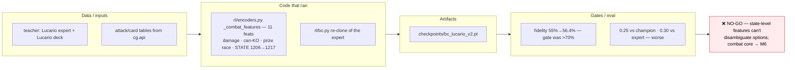

### M4 — deck search ([M4.md](M4.md)) ⚖️
Hill-climb over the Lucario deck's flex slots. Method lessons: noisy small-n ratings promote
losers (openskill evolve rolled back); fitness vs the *mirror* overfits (60% vs seed but worse
vs the field). Honest diverse-field run: seed fitness 0.84, **0/30 mutations improved it** —
the hand-tuned deck was already optimal. (M10 later proved it card-for-card identical to the
leaderboard's dominant list.)

```mermaid
flowchart LR
    subgraph IN4["Data / inputs"]
        A4["seed: tuned Lucario deck — 44 flex slots,<br/>Pokémon core fixed"]
        B4["fitness field: Iono + bc_v1 champion"]
    end
    subgraph RUN4["Code that ran"]
        C4["rl/deck_search.py — mutate_flex · matchup ·<br/>rate_population openskill · evolve · hill_climb"]
        D4["150-game accept test per mutation,<br/>slot-fair engine loop"]
    end
    subgraph ART4["Artifacts"]
        E4["deck variants — one mirror-overfit +1<br/>Heavy Baton + Wally's Compassion"]
    end
    subgraph GATE4["Gates / eval"]
        F4["evolve: noisy small-n promoted a loser — bug"]
        G4M["mirror hill-climb 0.60 vs seed but worse vs field"]
        H4["diverse field: 0/30 mutations beat seed, fitness 0.84"]
    end
    V4["⚖️ deck already optimal — search honest,<br/>nothing to find; bottleneck = field diversity"]
    IN4 --> RUN4 --> ART4 --> GATE4 --> V4
    style V4 fill:#fff8e1,stroke:#f9a825,color:#000
```

### M5 — heuristic tuning + hybrid ([M5.md](M5.md)) ❌
Parameterized the expert's magic numbers: 0/20 proposals beat defaults. Rule-agent +
neural value-head 1-ply override lost at every margin despite 0.92 sign-accuracy — first
sighting of "a win/loss classifier can't rank actions", which recurs in M8.4. Conclusion after
M1–M5: the provided rule agent is a hard ceiling for this toolset on CPU; the untapped signal
is the real leaderboard.

```mermaid
flowchart LR
    subgraph IN5["Data / inputs"]
        A5["sample-agent/main.py magic numbers —<br/>attack scores · energy weights · target priorities"]
        B5["field: Iono + bc_v1 + past variants"]
    end
    subgraph RUN5["Code that ran"]
        C5["sample-agent-tuned/ — weights.json search<br/>hill-climb / CMA-ES via rl.teacher"]
        D5["rl/hybrid.py — rule agent + neural<br/>value-head 1-ply override"]
    end
    subgraph ART5["Artifacts"]
        E5["sample-agent-tuned/ package"]
        F5["checkpoints/hybrid_value.pt — 0.92 sign-acc"]
    end
    subgraph GATE5["Gates / eval"]
        G5M["0/20 weight proposals beat defaults 0.680"]
        H5["hybrid ≤0.46 at every override margin"]
    end
    V5["❌ NO-GO — rule agent is the ceiling;<br/>first sighting of classifier-can't-rank"]
    IN5 --> RUN5 --> ART5 --> GATE5 --> V5
    style V5 fill:#ffebee,stroke:#c62828,color:#000
```

### M6 — generic deck-agnostic pilot ([M6.md](M6.md)) ✅
The pivot: stop specializing, build a pilot that plays ANY deck via deck-blind tier scoring on
the combat core (`rl/generic_pilot.py`, pure-Python `rl/combat.py`, `submission_rules/`
bundle, `tcg/` twins with 202 parity tests). 0.95 vs random, deck-legible (77% ≈ expert's 76%
on Lucario-vs-Iono), but 0.25–0.30 vs the expert. GO for its actual purpose — the reusable
teacher/evaluator — with ship-strength deferred.

```mermaid
flowchart LR
    subgraph IN6["Data / inputs"]
        A6["M3 combat core"]
        B6["1,267-card pool via cards_features.parquet<br/>decks: lucario · iono · floor zero-damage"]
    end
    subgraph RUN6["Code that ran"]
        C6["rl/generic_pilot.py — priority tier scorer<br/>score_play · score_attack · score_card"]
        D6["rl/combat.py split — polars/torch-free"]
        E6["tcg/ twin package + 202 parity tests"]
        F6["rl.export --agent rules · rl.gate ·<br/>build_submission.ps1 -Agent rules"]
    end
    subgraph ART6["Artifacts"]
        G6M["submission_rules/ bundle —<br/>main.py + cg/ + 3-file rl/ + deck.csv"]
        H6["tcg/ package + tests/"]
    end
    subgraph GATE6["Gates / eval"]
        I6["0.95 vs random · floor 0.75"]
        J6["deck legibility 77% ≈ expert's 76%"]
        K6["0.25–0.30 vs expert — below 0.40 gate"]
    end
    V6["✅ GO as THE teacher/evaluator —<br/>shipped rules probe 54474043"]
    IN6 --> RUN6 --> ART6 --> GATE6 --> V6
    style V6 fill:#e8f5e9,stroke:#2e7d32,color:#000
```

### M7 — deck factory loop ([M7.md](M7.md), spec [M7-plan.md](M7-plan.md)) ✅ shipped ×2
The umbrella milestone. Landed: Kaggle ingestion (`rl/kaggle_ingest.py`), deck factory
(template decks did NOT reach human-tuned parity — 0/40), league + matchrunner (anchor
ordering reproduced M6 exactly, n=1600/anchor), race-math L1 ported deck-agnostically,
**turn solver L2** (`rl/turn_solver.py`, within-turn DFS on the engine forward model; A/B
0.533 over greedy, shipped 54586430), encoders v2 + `osv2_bc.pt` (fidelity 0.914 but plays
below teacher), PPO retry with the loss bug fixed (still rise-then-decay — but warm start was
later found confounded). Biggest find: **the play-tier bug** — live PLAY options carry no
`area` field, so trainer scoring never fired in real games since M6. Fixed with 4 more pilot
fixes → best pilot ever (floor 0.930, vs-expert 0.362), shipped 54621283. The L4 go/no-go
review declared the learning evidence confounded → forked into M8.

```mermaid
flowchart LR
    subgraph IN7["Data / inputs"]
        A7["Kaggle episodes — data/kaggle/raw/"]
        B7["data/shells.json · 7-anchor field ·<br/>3,000 generic-teacher BC games"]
    end
    subgraph RUN7["Code that ran"]
        C7["M7.0 rl/kaggle_ingest.py — fetch · parse · cluster"]
        D7["M7.1 rl/deck_build.py generate --n 40"]
        E7["M7.2 rl/matchrunner.py + rl/league.py<br/>M7.2b race-math in rl/combat.py"]
        F7["M7.3 encoders v2 + bc train --arch v2"]
        G7M["M7.4a rl/turn_solver.py — within-turn DFS<br/>M7.4b PPO loss-bug fix in rl/ppo.py"]
        H7["M7.5 rl/postmortem.py + tcg.shipping export/gate"]
    end
    subgraph ART7["Artifacts"]
        I7["episodes.parquet · opp_decks.parquet · meta_v1/"]
        J7["decks/gen/ 40 candidates · data/league/"]
        K7["osv2_bc.pt · ppo_m75_it49.pt"]
        L7["subs 54586430 · 54616196 · 54621283"]
    end
    subgraph GATE7["Gates / eval"]
        M7N["factory: 0/40 decks above anchor median"]
        N7["solver A/B 0.533 over greedy, p≈0.008"]
        O7["BC v2 val 0.914 but G3 0.44 — not shippable"]
        P7["play-tier bug found → 5 pilot fixes<br/>final floor 0.930 · vs-expert 0.362"]
    end
    V7["✅ SHIPPED ×2 — solver pilot becomes the<br/>campaign opponent; PPO confounded → fork M8"]
    IN7 --> RUN7 --> ART7 --> GATE7 --> V7
    style V7 fill:#e8f5e9,stroke:#2e7d32,color:#000
```

### M8 — beat-the-ship campaign ([M8.md](M8.md), report [M8-report.md](M8-report.md)) ❌ bar not cleared
Bar: ≥0.55 vs `solver:lucario` n≥800. M8.0 reset the instruments and measured the loss
taxonomy (attach-off-racer 55/100 ≫ hand-discard 38 > Boss's-Orders-hoarded 21). Results:
**M8.2 BC refresh ✅** — re-cloning the FIXED teacher gave `osv2_bc2.pt` **0.345** (+10.8pp
with zero RL; the single biggest finding). **M8.1 dev-tier solver ❌** killed (pooled 0.492,
n=1600). **M8.3 PPO probe ⚖️** — entropy diffusion cured, but peak verifies to **0.359**
(+1.4pp = noise): more PPO is a measured dead end. **M8.4** — L3 archetype determinizer ✅
(top-1 1.000 by turn 2), value on search states ✅ (sign-acc 0.57→0.85), but the **sims ladder
is FLAT ❌** (0.515/0.490/0.495 at 16/32/64): inference-time MCTS on this value head is a
dead end. M8.5 recommended NO-GO on AlphaZero-lite for this budget.

```mermaid
flowchart LR
    subgraph IN8["Data / inputs"]
        A8["fixed teachers: generic + solver pilots"]
        B8["env.toJSON game dumps for taxonomy"]
    end
    subgraph RUN8["Code that ran"]
        C8["M8.0 rl/postmortem.py batch — loss taxonomy"]
        D8["M8.1 dev-tier solver in rl/turn_solver.py"]
        E8["M8.2 rl/bc.py re-clone of the FIXED teacher"]
        F8["M8.3 rl/ppo.py probe + --shaping race/dev"]
        G8M["M8.4 rl/determinize.py + rl/value_train.py<br/>+ mcts: sims ladder"]
    end
    subgraph ART8["Artifacts"]
        H8["osv2_bc2.pt — 0.345, new BC base"]
        I8["ppo_m83_legB_it5.pt — 0.359, best neural"]
        J8["data/bc_v2b/ · data/bc_v2_solver/ ·<br/>bc_v1_value_search.pt · docs/M8-report.md"]
    end
    subgraph GATE8["Gates / eval"]
        K8["taxonomy: attach-off-racer 55/100 ≫<br/>hand-discard 38 &gt; trainer-hoarded 21"]
        L8["dev tier killed 0.492 n=1600"]
        M8N["BC refresh +10.8pp — biggest finding"]
        N8["PPO peak +1.4pp = noise · sims ladder FLAT"]
    end
    V8["❌ bar not cleared — 0.359 &lt; 0.55<br/>pinned baselines + 3 dead ends recorded"]
    IN8 --> RUN8 --> ART8 --> GATE8 --> V8
    style V8 fill:#ffebee,stroke:#c62828,color:#000
```

### M10 — clone the leaderboard ([M10.md](M10.md)) ❌ NO-GO
The one beyond-teacher path: imitate 600–1345-scoring teams from Kaggle episode replays.
Built the snowball harvest (2,123 episodes, 236,446 decisions, 3,619 teacher seats ≥550) and
the replay→shard converter with G0/G1 gates. Both recipes died at G3 (fine-tune 0.318,
elite-only 0.292, vs base 0.345): elite fidelity **saturated at 0.527** — the same signature as
the retired rule-pilot teacher. Generalized dead end: **BC from replays of agents whose
reasoning is search/hidden-state (unobservable)**. Keepers: harvest infra, converter, the
**meta_v2 co-gate** (ship 0.448 · osv2_bc2 0.405), and proof our deck IS the meta (~89%
Lucario mirrors at the top; dominant list diffs empty vs `decks/lucario.csv`).

```mermaid
flowchart LR
    subgraph IN10["Data / inputs"]
        A10["Kaggle leaderboard teams scoring 600–1,345"]
        B10["warm start osv2_bc2.pt ·<br/>self-play corpus data/bc_v2b 200k decisions"]
    end
    subgraph RUN10["Code that ran"]
        C10["kaggle_ingest leaderboard · targets ·<br/>refresh --opp-subs — snowball harvest"]
        D10["rl/replay_bc.py — audit · roundtrip ·<br/>build --min-score 550 / 800 · meta-eval"]
        E10["rl/bc.py train — multi-dir · --init · --weighting"]
        F10["rl/matchrunner.py play — G3 screens seeds 716/717"]
    end
    subgraph ART10["Artifacts"]
        G10M["2,123-episode cache, 172MB"]
        H10["data/bc_kaggle/ 236k decisions ·<br/>data/bc_kaggle_elite/ 34k"]
        I10["osv2_kbc1.pt · osv2_kbc2.pt ·<br/>data/kaggle/meta_v2/ frozen pool"]
    end
    subgraph GATE10["Gates / eval"]
        J10["G0 PASS · G1 roundtrip 1.0000 — 722/722"]
        K10["G2 offline 0.651→0.691 PASS"]
        L10["G3 KILLS: A 0.318 · B′ 0.292 vs 0.345 base"]
        M10N["elite fidelity saturates 0.527 — mechanism"]
    end
    V10["❌ NO-GO — unobservable teachers; keepers:<br/>harvest · converter · meta co-gate · deck=meta"]
    IN10 --> RUN10 --> ART10 --> GATE10 --> V10
    style V10 fill:#ffebee,stroke:#c62828,color:#000
```

### M9 — pilot-fix + learning ladder ([M9-plan.md](M9-plan.md)) 🚧 in progress
Restored 2026-07-16 as lead track. **Leg 1 (lead):** pilot v2 fixes behind a default-off
`fixes` flag — Fix A hand-discard (Carmine burned t1, 38/100) + Fix B gust (Boss's Orders
hoarded, 21/100); `solver2:` vs `solver:` gate ≥0.53 at n=400, can clear the bar outright.
**Leg 2 (top learning rung):** DAgger on the solver — the strongest *observable and
queryable* teacher — student states, teacher labels → `osv2_dagger1.pt` (gate on win-rate
progress, never fidelity). Then Leg 3 disagreement-weighted distillation, Leg 4
value-as-ranker probe (offline-gated), Leg 5 gated KL-PPO + AZ-lite (Piotr sign-off).

```mermaid
flowchart LR
    subgraph IN9["Data / inputs — planned"]
        A9["teacher: solver — observable AND queryable"]
        B9["warm start osv2_bc2.pt ·<br/>data/bc_v2b + new data/bc_dagger"]
    end
    subgraph RUN9["Code to run — planned"]
        C9["Leg 1: fixes flag in rl/generic_pilot.py +<br/>rl/turn_solver.py → solver2: spec"]
        D9["Leg 2: rl/bc.py collect_dagger —<br/>student picks, solver labels"]
        E9["Leg 3: solver_diff column + weighted CE W=10"]
        F9["Leg 4: score_siblings + pairwise ranking head"]
        G9M["Leg 5 gated: KL-PPO + AZ-lite — Piotr sign-off"]
    end
    subgraph ART9["Artifacts — planned"]
        H9["osv2_dagger1.pt · osv2_soldis1.pt ·<br/>bc_v1_rank.pt · ppo_m9_kl.pt"]
        I9["docs/M9.md diary · runs/m9_*.jsonl"]
    end
    subgraph GATE9["Gates"]
        J9["Leg 1 go ≥0.53 · imitation legs go ≥0.375"]
        K9["promotion: ≥0.55 pooled n≥1200, both seeds<br/>&gt;0.52 + floors + meta_v2 co-gate"]
    end
    V9["🚧 IN PROGRESS — Leg 1 lead ∥ Leg 2;<br/>restored 07-16 after M10 NO-GO"]
    IN9 --> RUN9 --> ART9 --> GATE9 --> V9
    style V9 fill:#e3f2fd,stroke:#1565c0,color:#000
```

## Cross-cutting findings

- **The fidelity law:** agent strength ≈ teacher strength × imitation fidelity — and fidelity
  collapses (~0.53–0.56 ceiling) on teachers whose reasoning is unobservable (rule-pilot
  `AttackPlan`, M3; leaderboard replays, M10).
- **Teacher rule (settled 07-14, strengthened by M10):** pick the strongest teacher whose
  reasoning is **observable** — and now *queryable*: the solver.
- **A win/loss classifier can't rank sibling actions:** the same value-head failure sighted in
  M5 (hybrid), M2/M8.4 (MCTS), motivating M9 Leg 4's pairwise ranking head.
- **Measured dead ends (do not re-propose):** more PPO iterations on the current loop
  (M8.3, reproduced 07-14) · inference-time MCTS on the current value head (M8.4) ·
  dev-tier solver (M8.1) · rule-pilot BC teacher (M1–M3) · BC from replays of search-based
  agents (M10).
- **Pinned baselines vs `solver:lucario`:** `osv2_bc2` 0.345 · `ppo_m83_legB_it5` 0.359 ·
  solver mirror 0.500. Meta_v2 co-gate: ship 0.448 · `osv2_bc2` 0.405.
- **Ship history:** 54444045 (bc_v1, M1) → 54474043 (rules probe, M6) → 54586430
  (solver-on, M7.4a) → 54621283 (solver + 5 pilot fixes, M7.5 — current live).

## Glossary

- **fidelity** — fraction of held-out teacher decisions the student picks identically
  (top-1 agreement). Governs the **fidelity law**: agent strength ≈ teacher strength ×
  fidelity (M2).
- **BC (behavior cloning)** — supervised imitation: given (state, option menu), predict the
  teacher's pick; trained with masked cross-entropy in `rl/bc.py`.
- **teacher / student** — the policy that generates decision labels vs the network trained
  on them.
- **observable teacher** — a teacher whose decisions are fully explainable from the encoded
  observation. Teachers that reason with search or hidden state (the expert's `AttackPlan`,
  leaderboard replay agents) cap student fidelity at ~0.53–0.56 (M3, M10).
- **DAgger** — imitation variant that collects states from the *student's own play* and
  labels them with the teacher, fixing plain BC's distribution shift (M9 Leg 2).
- **disagreement-weighted distillation** — BC where the rare decisions on which two teachers
  disagree are upweighted (W=10), so the stronger teacher's edge isn't drowned out (M9 Leg 3).
- **pilot** — a rule-based policy that plays a deck (`rl/generic_pilot.py` = the generic,
  deck-agnostic one). **expert** — the competition-provided Lucario sample agent
  (`sample-agent/`). **solver / turn solver** — the pilot plus a within-turn DFS on the
  engine's forward model (`rl/turn_solver.py`); `solver:lucario` is the shipped agent and
  the campaign's eval opponent.
- **champion** — the current best own agent+deck pairing at any point in the campaign.
- **the bar** — the campaign success criterion since M8: win rate ≥0.55 vs `solver:lucario`
  at n≥800.
- **gate** — a pass/fail measurement with a pre-declared threshold and kill criterion.
  M10's ladder: G0 converter audit, G1 roundtrip/crash, G2 offline fidelity, G3 win-rate
  screen, G4 meta co-gate. **floor** — sanity minimums every promotion must hold: ≥0.90 vs
  `random:kyogre` (n=200 × 2 seeds), no regression vs `rule:lucario` (0.362).
- **screen / confirm / promotion** — the measurement ladder: n=400 one-seed screen → n=800
  fresh-seed confirm → promotion at pooled n≥1200 with both seeds >0.52 plus floors.
- **meta_v2 co-gate** — weighted win rate vs the frozen top-archetype deck pool harvested
  from the real leaderboard, each deck solver-piloted (n=60/deck). Pinned baselines: ship
  0.448 · osv2_bc2 0.405. Run via `python -m rl.replay_bc meta-eval`.
- **slot-fair** — evaluations alternate which agent sits in player slot 0, because slot 0
  carries a ~61% built-in advantage (M1).
- **aliased menus** — action menus whose encoded option vectors are identical, so no policy
  can tell the options apart; capped v1-encoding index accuracy (~67% of menus) until the
  Stage B / v2 encoders (M1, M3).
- **value head / classifier-not-ranker** — the network's win-probability output. It learns
  to classify won-vs-lost states but cannot *rank* sibling actions from the same state — the
  failure behind the M5 hybrid, M2/M8.4 MCTS, and the motivation for M9 Leg 4's pairwise
  ranking head.
- **sims ladder** — win rate as MCTS simulation count rises (16/32/64). A flat ladder means
  search adds nothing over the raw policy (M8.4).
- **determinizer** — infers the hidden parts of the game (the opponent's deck) so search has
  a complete state to roll forward (`rl/determinize.py`; archetype top-1 1.000 by turn 2).
- **PPO / KL-anchored PPO** — the RL fine-tuning loop (`rl/ppo.py`, GAE + clipped update).
  The KL-anchored variant (M9 Leg 5a) adds a penalty toward the BC policy to stop the
  reproduced peak-then-decay drift.
- **shard** — one `.npz` chunk of BC training decisions (`data/bc_*/shard_NNNN.npz`).
  **warm start (`--init`)** — fine-tuning from an existing checkpoint instead of from
  scratch.
- **snowball harvest** — collecting Kaggle episodes by walking the opponents-of-opponents
  submission graph (`kaggle_ingest targets` → `refresh --opp-subs`), needed since Kaggle
  retired the per-team episode filter (M10).
- **twins (`rl/` vs `tcg/`)** — training-side and submission-side copies of the shared
  modules (pilot, combat, constants), kept byte-identical by parity tests; `tcg/` is only
  mirrored after a change survives measurement.
- **dead end** — a lever measured to a NO-GO that must not be re-proposed; the list lives in
  Cross-cutting findings above.
